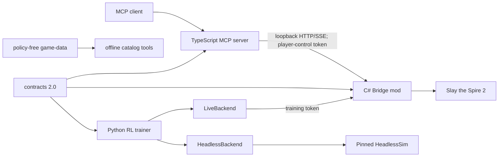

# sts2-mcp

[](#)
[](./README.zh-CN.md)

`sts2-mcp` is a local control and reinforcement-learning stack for **Slay the Spire 2**.
A C# mod observes the game and executes explicit legal actions, a TypeScript server
exposes a Model Context Protocol (MCP) surface, and the Python package trains and
evaluates the grounded legal-candidate actor-critic baseline.

This repository is in the **architecture-v2 cutover**. The v2 contract and capability
model are the development target. Legacy v1 endpoints are disabled by default and,
together with remaining compatibility wrappers, exist only for an explicit migration;
they must not receive new features.

> [!WARNING]
> This is an unofficial research project. It is not affiliated with or endorsed by
> Mega Crit. The Bridge runs inside the game process and can mutate a run. Back up
> saves and training artifacts, use only a game build you are authorized to run, and
> expect game updates to require adapter changes.

## Current components

| Component | Version | Responsibility |
|---|---:|---|
| [`contracts/`](./contracts/README.md) | API `2.0.0` | JSON Schema, OpenAPI, fixtures, generated cross-language version constants |
| [`game-data/`](./game-data/README.md) | `2.0.0` | Policy-free static card, relic, and potion facts |
| [`mods/sts2-bridge/`](./mods/sts2-bridge/README.md) | `0.9.0` | Game adapter, visible snapshots, legal handles, command serialization, session discovery |
| [`packages/mcp-server/`](./packages/mcp-server/README.md) | `0.5.0` | TypeScript MCP server using the official SDK; default `minimal` control surface |
| [`packages/rl-agent/`](./docs/rl-grounded-baseline.md) | `0.4.0` | Relational legal-candidate model, typed backends, dual-scale memory, fixed task reward, FIFO unrolls, V-trace and checkpoints |
| [`tools/`](./tools) | — | Contract, data, artifact, release, license, and repository checks |

Component versions are coordinated through [`release-manifest.json`](./release-manifest.json).
The contract manifest is the wire-format authority; package READMEs describe
component-specific behavior.

## Architecture and ownership



The dependency and ownership rules are deliberate:

- `contracts` is the shared runtime leaf dependency. `game-data` is a verified
  offline factual catalog, not a policy input or grounded-trainer dependency.
- The Bridge owns factual game adaptation, legal actions, state revision, idempotent
  mutation arbitration, session lifecycle, and bounded events.
- The MCP server owns protocol framing, input validation, presentation, and small
  player-control workflows. It does not own reward, RL state, journal storage, or
  arbitrary knowledge-file access.
- The RL package owns episode semantics, observations, actions, reward, curriculum,
  FIFO rollout data, models, checkpoints, and experiment metadata.
- The Bridge and MCP server must not import data or code through an RL package path.
- Runtime artifacts do not belong in the source checkout.

See [`docs/architecture.md`](./docs/architecture.md), the accepted
[`docs/adr/`](./docs/adr) decisions, and the
[v2 cutover gates](./docs/migration/v2-cutover.md).

## V2 safety model

The Bridge publishes separate capabilities:

- **`player-control`**: player-visible state and explicit legal actions. It cannot
  reset a run, select a seed, start a sandbox, export catalogs, or expose hidden
  draw order.
- **`training`**: privileged reset/step/sandbox operations under a distinct token.
  It is disabled by default in the Bridge and exposed only by the MCP `debug` profile.
- **catalog tooling**: static export and generation are offline tools, not
  player-control HTTP mutations.

Every v2 mutation carries a caller-generated `request_id`, active `session_id`,
capability, expected state revision, and deadline. The Bridge serializes game
mutations, resolves the action against the current state on the game thread, and
retains its identity/result for the advertised retention window. It never evicts an
unexpired identity to make room; admission fails explicitly at capacity.

Legacy v1 mutations do **not** provide the same idempotency guarantee. The new MCP
client sends them once and reports timeouts as `outcome_unknown`; it does not invent
a retry.

## Requirements

- Windows and a legal local installation of Slay the Spire 2 for full Bridge builds
  and live-game tests.
- [.NET SDK 9.0.308](https://dotnet.microsoft.com/) for Bridge core tests and builds.
- [Node.js 22.14.0](https://nodejs.org/) with npm 10.9.2 for the MCP server.
- Python 3.11 or newer for RL and repository tooling; reproducible CI uses 3.13.3.

The repository pins exact .NET, Node, npm, and CI Python versions in
[`global.json`](./global.json), [`.nvmrc`](./.nvmrc), the MCP `packageManager`, and
[`.python-version`](./.python-version), respectively.

## Quick start: MCP player control

### 1. Build and test the MCP server

```powershell
Set-Location .\packages\mcp-server
npm ci
npm run typecheck
npm test
Set-Location ..\..
```

### 2. Build the Bridge

The complete build needs assemblies from the installed game:

```powershell
$env:STS2_DIR = '<PATH_TO_STS2>'
dotnet build .\mods\sts2-bridge\sts2-bridge.csproj
```

A normal build does not deploy. Deployment is explicit:

```powershell
dotnet build .\mods\sts2-bridge\sts2-bridge.csproj -p:Sts2Deploy=true
```

Core command, idempotency, environment, and lifecycle tests do not require the
commercial game assemblies:

```powershell
dotnet run --project .\mods\sts2-bridge\tests\BridgeCore.Tests\BridgeCore.Tests.csproj --configuration Release
```

### 3. Start the game and MCP server

After the Bridge loads, it writes a session descriptor under the current user's
application-data STS2 `bridge` directory. Do not print or commit that descriptor:
it contains bearer credentials.

Run the normal minimal profile:

```powershell
$env:STS2_MCP_PROFILE = 'minimal'
node .\packages\mcp-server\index.js
```

For an MCP host, copy [`.mcp.example.json`](./.mcp.example.json), replace
`<REPOSITORY_ROOT>` with the absolute checkout path required by that host, and keep
`STS2_MCP_PROFILE=minimal`. Session discovery uses the current user's application-data
directory by default; `STS2_BRIDGE_SESSION_FILE` is available for explicit
multi-instance configurations.

| Profile | Intended use |
|---|---|
| `minimal` | Default player-visible status, state, legal actions, strict control, and safe waits |
| `strategic` | `minimal` plus deck/map views and deliberately ordered action sequences |
| `debug` | Privileged local development/training tools; never the normal player profile |

## RL development and training

The maintained entry point is the **relational grounded-candidate V-trace v3 baseline**.
The failed MuZero/token-memory/MCTS line, PPO paths, planners and hand-written
action guards have been removed:

```powershell
Set-Location .\packages\rl-agent
python -m venv .venv
.\.venv\Scripts\Activate.ps1
$env:PIP_EXTRA_INDEX_URL = 'https://download.pytorch.org/whl/cpu'
python -m pip install -r requirements-bootstrap.lock
python -m pip install -r requirements-dev.lock
python -m pip install -e . --no-deps --no-build-isolation
python -m pytest tests -q -p no:cacheprovider
python -m sts2_rl.train --dry-run
```

Start the optional combat bootstrap or the full-run mainline with:

```powershell
python -m sts2_rl.train --profile combat --sim-exe <PINNED_HEADLESS_SIM_RELEASE_EXE>
python -m sts2_rl.train --profile default --sim-exe <PINNED_HEADLESS_SIM_RELEASE_EXE>
```

Monitor persistent runs from a loopback-only, read-only local dashboard:

```powershell
.\scripts\start_training_dashboard.ps1
```

The page keeps online training samples separate from fixed-seed held-out
evaluation and explicitly labels unlimited hidden-engine-bailout preheat as a
non-standard win context. See the
[training dashboard runbook](./docs/runbooks/training-dashboard.md).

Formal headless runs require a `Release` simulator built from the locked
`sts2-ai` commit and a matching binary-identity sidecar. Debug, stale, dirty-
source, and hash-mismatched binaries are rejected before the simulator starts.
See [HeadlessSim build identity](./docs/headless-simulator-identity.md) for the
build and verification procedure.

The default model has 4,014,146 parameters, scores only currently grounded legal
candidates, and splits its 256-wide GRU state into run- and combat-scale memory.
It learns from factual definition/instance/zone/source/target relationships with
no latent dynamics, MCTS, planner or game-specific action rewrite. Reward is fixed and normalized. Actors stream
64-decision recurrent unrolls through a bounded FIFO; the V-trace learner consumes
each unroll once, with no replay sampling or priorities. Encodings remain compact
sparse snapshots, so learner updates do not re-parse raw JSON. See
[`docs/rl-grounded-baseline.md`](./docs/rl-grounded-baseline.md).

Collector and learner now overlap by construction. A dedicated actor model on the
configured collector device publishes versioned unrolls into a capacity-256 queue;
the learner applies bounded-lag V-trace correction and republishes parameters only
at actor episode boundaries.

The v1/v2 runs are retained only as failure evidence and are not model or replay
initialization sources. A compatible v3 network may be imported explicitly with
`--initialize-from`; this initializes model parameters only and starts a new
optimizer/queue/RNG/counter lineage rather than pretending to resume. No v3
performance claim exists without fixed odd-seed evaluation counts and rates.

## Contracts and game data

The current contract identity is:

- API: `2.0.0`
- schema: `2026-07-17.1`
- action schema: `2.1.0`
- action ordering: `2.0.0`
- observation schema: `5.0.0`
- reward schema: `2.0.0`

Validate contracts, generated versions, game data, release versions, and repository
hygiene from the repository root:

```powershell
python .\tools\contracts\check_contracts.py
python .\tools\game_data\verify_manifest.py
python .\tools\release\check_versions.py
python .\tools\ci\check_generated.py
python .\tools\ci\check_repository.py
```

After an intentional game-data change, rebuild its deterministic manifest:

```powershell
python .\tools\game_data\build_manifest.py
python .\tools\game_data\verify_manifest.py
```

Consumers resolve [`game-data/`](./game-data) from the repository by default or
from `STS2_GAME_DATA_ROOT`. They must not add dependencies on
`packages/rl-agent/content`.

## Artifact boundary

Checkpoints, optimizer state, pending rollout queues, datasets, logs, virtual environments, release
binaries, PIDs, and temporary decompilations must live outside the source checkout.
Configure an external directory through `STS2_ARTIFACT_ROOT`.

Before moving existing artifacts, stop writers and create an inventory:

```powershell
python .\tools\artifacts\inventory.py --output '<ARTIFACT_ROOT>\pre-move-inventory.json'
.\tools\artifacts\move_to_artifact_root.ps1 -ArtifactRoot '<ARTIFACT_ROOT>' -Mode DryRun
```

The PowerShell command requires an explicit mode. Use `-Mode DryRun` first and `-Mode Execute` only after approval. Review the
inventory, backup, source and destination paths first. The migration tool refuses
to overwrite an existing destination. See
[`docs/runbooks/artifacts.md`](./docs/runbooks/artifacts.md).

## Test matrix

| Layer | Command | Needs the game? |
|---|---|---:|
| Contracts/data/repository | `python tools/...` checks shown above | No |
| MCP | `npm ci && npm run typecheck && npm test` in `packages/mcp-server` | No |
| Bridge core | `dotnet run --project mods/sts2-bridge/tests/BridgeCore.Tests/BridgeCore.Tests.csproj --configuration Release` | No |
| Bridge full build | `dotnet build mods/sts2-bridge/sts2-bridge.csproj` | Yes, for referenced assemblies |
| RL | `python -m pytest tests -q -p no:cacheprovider` in `packages/rl-agent` | Most tests do not; live tests do |
| Live end-to-end | Bridge + MCP/player or RL backend smoke | Yes |

CI runs dependency-free contract, hygiene, MCP, Bridge-core, and RL suites.
Live-game compatibility remains an explicit self-hosted/manual gate because retail
game assemblies are not committed.

## Compatibility and migration warning

- `legacy-v1` endpoints are dual-stack migration surfaces, not the security or
  reliability target.
- A legacy mutation timeout has an unknown outcome. Refresh state and reconcile
  rather than sending the same intent again.
- The normal MCP profile changed from historical `debug` behavior to `minimal`.
- Strict `expected_state_version` is required for gameplay mutation.
- Training reset/step requires the training capability; step is bound to
  `episode_id` and `expected_step_index`.
- Old replay and checkpoint files are not compatible. Recurrent-v2 exact resume
  validates contract, action ordering, observation/reward identity, dependency
  locks, encoding fingerprint, learner/actor/optimizer/rollout-queue and stochastic state, and
  fails closed on unsupported formats. Valid static game-data is optional audit
  provenance, not a runtime or model compatibility input.
- Historical journal/knowledge persistence, AutoSlay runners, Draft Tracker, PPO
  pipeline descriptions, checked-in logs, and release binaries are outside the v2
  control-plane source tree.

Read [`docs/migration/README.md`](./docs/migration/README.md) before converting a
live setup or resuming an old experiment.

## Documentation

The documentation authority and archive policy are indexed in
[`docs/README.md`](./docs/README.md). Dated experiment plans are historical research
records unless a canonical page explicitly links them as current.

## License

[MIT](./LICENSE)
