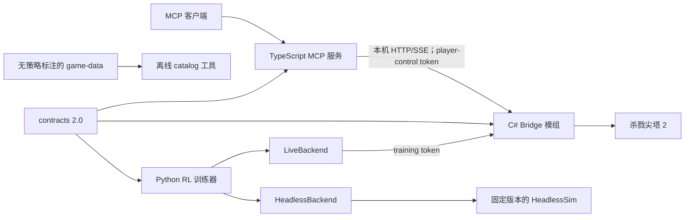

# sts2-mcp

[](#)
[](./README.md)

`sts2-mcp` 是一个面向 **《杀戮尖塔 2》** 的本地控制与强化学习工程。
C# Bridge 模组负责读取游戏事实并执行显式合法动作，TypeScript 服务通过
Model Context Protocol（MCP）提供工具，Python 包负责新的 grounded legal-candidate
actor-critic baseline 的训练与评估。

仓库目前处于 **architecture-v2 切换期**。v2 契约和能力模型是唯一的新开发
目标；legacy v1 端点默认关闭，与剩余 Python 兼容包装一样，仅为显式迁移
保留，禁止继续向其中增加新功能。

> [!WARNING]
> 本项目为非官方研究项目，与 Mega Crit 无隶属或背书关系。Bridge 在游戏
> 进程内运行并能够改变存档状态。请备份存档和训练资产，仅在你有权使用的
> 游戏版本上运行；游戏更新后可能需要重新适配。

## 当前组件

| 组件 | 版本 | 职责 |
|---|---:|---|
| [`contracts/`](./contracts/README.md) | API `2.0.0` | JSON Schema、OpenAPI、fixture 与跨语言版本常量 |
| [`game-data/`](./game-data/README.md) | `2.0.0` | 不含策略标注的卡牌、遗物与药水静态事实 |
| [`mods/sts2-bridge/`](./mods/sts2-bridge/README.md) | `0.9.0` | 游戏适配、可见状态、合法动作、串行命令与会话发现 |
| [`packages/mcp-server/`](./packages/mcp-server/README.md) | `0.5.0` | 使用官方 SDK 的 TypeScript MCP 服务；默认 `minimal` |
| [`packages/rl-agent/`](./docs/rl-grounded-baseline.md) | `0.4.0` | 关系化合法候选模型、类型化 backend、双时间尺度记忆、固定 reward、FIFO unroll、V-trace 与 checkpoint |
| [`tools/`](./tools) | — | 契约、数据、资产、发布、许可证和仓库检查 |

组件版本由 [`release-manifest.json`](./release-manifest.json) 协调。线协议以
`contracts/manifest.json` 为准；组件行为以对应包 README 为准。

## 架构与所有权



依赖和职责边界是强约束：

- `contracts` 是运行时共享的叶子依赖；`game-data` 只是经过校验的离线事实
  catalog，不是策略输入，也不是 grounded 训练器运行依赖。
- Bridge 只拥有游戏事实适配、合法动作、状态 revision、幂等突变仲裁、
  session 生命周期和有界事件。
- MCP 服务只拥有协议、输入校验、表现层和小型玩家控制 workflow；不拥有
  reward、RL 状态、journal 或任意知识文件读取。
- RL 包是 episode、observation、action encoding、reward、curriculum、replay、
  model、checkpoint 和实验元数据的唯一所有者。
- Bridge 与 MCP 不得通过 RL 包路径导入数据或代码。
- checkpoint、数据集、日志、虚拟环境和发布二进制不属于源码仓。

详见 [`docs/architecture.md`](./docs/architecture.md)、已接受的
[ADR](./docs/adr) 以及 [v2 切换门禁](./docs/migration/v2-cutover.md)。

## v2 安全模型

Bridge 发布相互独立的能力：

- **`player-control`**：仅玩家可见状态和显式合法动作；不能 reset、指定 seed、
  启动 sandbox、导出 catalog 或暴露隐藏抽牌顺序。
- **`training`**：使用独立 token 的特权 reset/step/sandbox。Bridge 默认关闭，
  MCP 中只由显式 `debug` profile 暴露。
- **catalog 工具**：静态导出和生成属于离线工具，不属于玩家控制 HTTP 突变。

每个 v2 突变都必须携带调用方生成的 `request_id`、当前 `session_id`、能力、
预期状态 revision 和 deadline。Bridge 串行处理全部游戏突变，在游戏主线程
针对当前状态重新解析动作，并在协议公布的保留窗口内保留 identity/result。
未过期的 request identity 绝不会为了腾出容量而被淘汰；容量满时会明确拒绝
新请求。

legacy v1 突变不提供同等幂等保证。新版 MCP 对 legacy 突变只发送一次；
timeout 被视为 `outcome_unknown`，不会自动重试。

## 环境要求

- 完整 Bridge 构建和 live-game 测试：Windows、你有权使用的《杀戮尖塔 2》。
- Bridge core 测试与构建：[.NET SDK 9.0.308](https://dotnet.microsoft.com/)。
- MCP 服务：[Node.js 22.14.0](https://nodejs.org/)，npm 10.9.2。
- RL 与仓库工具：Python 3.11 及以上；可复现 CI 使用 3.13.3。

[`global.json`](./global.json)、[`.nvmrc`](./.nvmrc)、MCP `packageManager` 与
[`.python-version`](./.python-version) 分别精确固定 .NET、Node、npm 与 CI Python。

## 快速开始：MCP 玩家控制

### 1. 构建并测试 MCP

```powershell
Set-Location .\packages\mcp-server
npm ci
npm run typecheck
npm test
Set-Location ..\..
```

### 2. 构建 Bridge

完整构建需要已安装游戏的程序集：

```powershell
$env:STS2_DIR = '<PATH_TO_STS2>'
dotnet build .\mods\sts2-bridge\sts2-bridge.csproj
```

普通 build 不会部署到游戏；部署必须显式开启：

```powershell
dotnet build .\mods\sts2-bridge\sts2-bridge.csproj -p:Sts2Deploy=true
```

命令、幂等、环境和生命周期 core 测试不需要商业游戏程序集：

```powershell
dotnet run --project .\mods\sts2-bridge\tests\BridgeCore.Tests\BridgeCore.Tests.csproj --configuration Release
```

### 3. 启动游戏和 MCP

Bridge 加载后会在当前用户 application-data 下的 STS2 `bridge` 目录写入
session descriptor。不要打印或提交该文件，其中包含 bearer credential。

正常使用必须启动默认最小 profile：

```powershell
$env:STS2_MCP_PROFILE = 'minimal'
node .\packages\mcp-server\index.js
```

配置 MCP host 时，复制 [`.mcp.example.json`](./.mcp.example.json)，把
`<REPOSITORY_ROOT>` 替换成该 host 所需的 checkout 绝对路径，并保留
`STS2_MCP_PROFILE=minimal`。默认 session 发现不需要写开发者目录；多实例时
可显式设置 `STS2_BRIDGE_SESSION_FILE`。

| Profile | 用途 |
|---|---|
| `minimal` | 默认玩家可见状态、合法动作、严格控制和安全等待 |
| `strategic` | `minimal` 加 deck/map 视图和有序动作序列 |
| `debug` | 特权本地开发与训练环境工具；禁止作为普通玩家配置 |

## RL 开发与训练

当前唯一受维护的训练入口是 **关系化 grounded-candidate V-trace v3 baseline**。
失败的 MuZero/token-memory/MCTS、PPO、planner 与手写 action guard 已删除：

```powershell
Set-Location .\packages\rl-agent
python -m venv .venv
.\.venv\Scripts\Activate.ps1
$env:PIP_EXTRA_INDEX_URL = 'https://download.pytorch.org/whl/cpu'
python -m pip install -r requirements-bootstrap.lock
python -m pip install -r requirements-dev.lock
python -m pip install -e . --no-deps --no-build-isolation
python -m pytest tests -q -p no:cacheprovider
python -m sts2_rl.train --dry-run
```

可选的 combat bootstrap 与正式 full-run 主线：

```powershell
python -m sts2_rl.train --profile combat --sim-exe <PINNED_HEADLESS_SIM_RELEASE_EXE>
python -m sts2_rl.train --profile default --sim-exe <PINNED_HEADLESS_SIM_RELEASE_EXE>
```

使用仅绑定本机回环地址、只读的监控面板查看持久化训练：

```powershell
.\scripts\start_training_dashboard.ps1
```

面板严格分开展示在线训练样本和固定种子 held-out 评估，并把无限隐藏引擎续命预热
明确标为非标准胜率上下文。详见
[训练监控面板 runbook](./docs/runbooks/training-dashboard.md)。

正式无头训练必须使用从锁定 `sts2-ai` 提交构建的 `Release` 模拟器，并提供与
二进制匹配的身份 sidecar。Debug、过期、脏源码构建或哈希不一致的二进制都会在
模拟器启动前被拒绝。构建和验证流程见
[HeadlessSim 构建身份](./docs/headless-simulator-identity.md)。

默认模型有 4,014,146 个参数，只对当前合法候选评分；256 维循环状态拆为全局流程
与局内战斗两个时间尺度。模型接收事实性的定义、实例、牌堆区域、动作来源和目标关系，
不包含 latent dynamics、MCTS、planner 或游戏特定 action rewrite。Reward 固定且归一化。
Actor 将 64 步连续 recurrent unroll 写入有界 FIFO，V-trace learner 每条只消费一次，
没有 replay sampling 或 priority。紧凑稀疏 snapshot 使 learner 无需重复解析原始 JSON。详见
[`docs/rl-grounded-baseline.md`](./docs/rl-grounded-baseline.md)。

Collector 与 learner 默认异步重叠。独立 actor 模型在 collector device 上生成带策略
版本的 unroll，容量 256 的队列提供反压；learner 进行有界策略滞后的 V-trace 修正，
并只在 actor 的 episode 边界发布新参数。

软件闭环已有测试，但目前还没有新架构长期训练 checkpoint 或 Act 1 clear-rate
成绩，不能把 dry-run/单元测试误报为模型效果。所选 backend 的 v2 parity 未通过前，
不要启动长训练。

## 契约与 game-data

当前契约标识：

- API：`2.0.0`
- schema：`2026-07-17.1`
- action schema：`2.1.0`
- action ordering：`2.0.0`
- observation schema：`5.0.0`
- reward schema：`2.0.0`

在仓库根目录验证契约、生成文件、game-data、发布版本和仓库卫生：

```powershell
python .\tools\contracts\check_contracts.py
python .\tools\game_data\verify_manifest.py
python .\tools\release\check_versions.py
python .\tools\ci\check_generated.py
python .\tools\ci\check_repository.py
```

有意修改 game-data 后，重建确定性 manifest：

```powershell
python .\tools\game_data\build_manifest.py
python .\tools\game_data\verify_manifest.py
```

消费者默认解析仓库内 [`game-data/`](./game-data)，也可使用
`STS2_GAME_DATA_ROOT`。禁止新增对 `packages/rl-agent/content` 的依赖。

## Artifact 边界

checkpoint、optimizer、replay、dataset、log、虚拟环境、发布二进制、PID 和
临时反编译文件必须位于源码 checkout 外，并通过 `STS2_ARTIFACT_ROOT` 配置。

移动已有资产前必须停止所有 writer 并生成 inventory：

```powershell
python .\tools\artifacts\inventory.py --output '<ARTIFACT_ROOT>\pre-move-inventory.json'
.\tools\artifacts\move_to_artifact_root.ps1 -ArtifactRoot '<ARTIFACT_ROOT>' -Mode DryRun
```

PowerShell 命令必须显式指定模式；先使用 `-Mode DryRun`，审核通过后才可使用 `-Mode Execute`。必须先审核
inventory、备份、源路径和目标路径。工具拒绝覆盖已有目标。详见
[`docs/runbooks/artifacts.md`](./docs/runbooks/artifacts.md)。

## 测试矩阵

| 层 | 命令 | 需要游戏？ |
|---|---|---:|
| 契约/数据/仓库 | 上述 `python tools/...` 检查 | 否 |
| MCP | 在 `packages/mcp-server` 执行 `npm ci && npm run typecheck && npm test` | 否 |
| Bridge core | `dotnet run --project mods/sts2-bridge/tests/BridgeCore.Tests/BridgeCore.Tests.csproj --configuration Release` | 否 |
| Bridge 完整构建 | `dotnet build mods/sts2-bridge/sts2-bridge.csproj` | 是，需要引用程序集 |
| RL | 在 `packages/rl-agent` 执行 `python -m pytest tests -q -p no:cacheprovider` | 多数测试不需要；live 测试需要 |
| Live E2E | Bridge + MCP/player 或 RL backend smoke | 是 |

CI 运行不依赖游戏的契约、卫生、MCP、Bridge-core 和 RL suite。由于零售游戏
程序集不能提交，live-game 兼容性仍是显式的自托管/人工门禁。

## 兼容与迁移警告

- `legacy-v1` 只是双栈迁移面，不是最终安全或可靠性边界。
- legacy 突变 timeout 的结果未知；应刷新状态并核对，禁止重发相同意图。
- 普通 MCP 默认从历史 `debug` 改为 `minimal`。
- 游戏突变必须提供严格的 `expected_state_version`。
- training reset/step 需要 training capability；step 与 `episode_id`、
  `expected_step_index` 绑定。
- 旧 replay/checkpoint 不兼容。Grounded exact resume 会校验 contract、action
  ordering、observation/reward、依赖锁、encoding fingerprint、model/optimizer/
  replay 与随机状态；不支持时 fail closed。有效的静态 game-data 仅可选地记入
  审计 provenance，不是运行依赖或模型兼容性输入。
- 历史 journal/knowledge、AutoSlay runner、Draft Tracker、PPO pipeline 文档、
  已提交日志和发布二进制均不属于 v2 control-plane 源码。

转换 live 环境或恢复旧实验前，必须阅读
[`docs/migration/README.md`](./docs/migration/README.md)。

## 文档

[`docs/README.md`](./docs/README.md) 定义文档权威与归档规则。除非被规范文档
明确引用为当前内容，带日期的实验计划均视为历史研究记录。

## 许可证

[MIT](./LICENSE)
