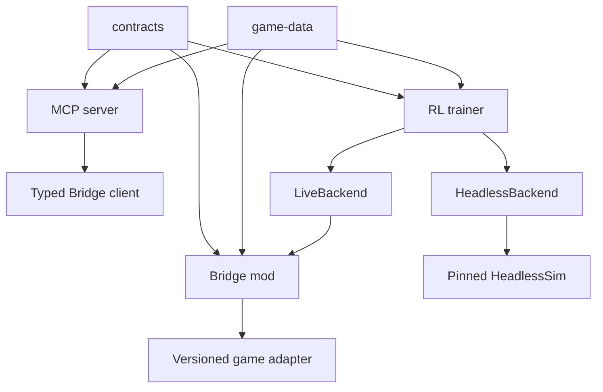

# Architecture v2

Status: normative during the architecture-v2 migration.

The contract API is `2.0.0`. Legacy v1 remains a temporary dual-stack surface and
is not the target security, concurrency, or training contract.

## Goals

- Read player-visible game state without OCR or foreground-window assumptions.
- Execute explicit legal actions through deterministic, idempotent commands.
- Keep player control, privileged training, and catalog generation in separate
  capability domains.
- Give C#, TypeScript, Python, and HeadlessSim one versioned contract.
- Make reward, replay, checkpoints, and experiments reproducible.
- Bound game-thread work, queues, HTTP resources, events, logs, and artifacts.
- Fail closed when the game adapter or a contract major version is incompatible.

## Non-goals

- Exposing arbitrary object invocation from the game process.
- Treating hidden game state as normal player-visible MCP data.
- Using the MCP server as a training runtime, journal database, or general file
  search service.
- Keeping every historical script or checkpoint executable forever.
- Committing commercial game assemblies, local virtual environments, training
  outputs, or release binaries.

## Dependency topology

Allowed direction is `contracts + game-data -> applications`. Bridge and MCP must
not import from the RL tree. Cross-language values are generated from the contract
manifest rather than copied by hand.

## Runtime domains

### Player control

The normal trust domain returns player-visible state and explicit legal actions.
It cannot reset, select a seed, start a combat sandbox, export catalogs, invoke
AutoSlay, or expose hidden draw order. It uses the `player-control` token and the
MCP `minimal` or `strategic` profile.

### Training

Training is privileged. Reset, step, seed, sandbox, and diagnostic operations use
a different token and an explicit Bridge enable flag. MCP exposes these tools only
through `debug`. Environment sessions have one owner, an episode ID, and an
expected step index.

### Catalog and content

Catalog export and content generation are offline/build tools. Generated content
is published through `game-data` with provenance and hashes; it is not a broad HTTP
filesystem-writing endpoint in the normal control plane.

## Component ownership

### Contracts

`contracts/` is the transport authority:

- JSON Schema 2020-12 documents;
- OpenAPI for Bridge v2;
- language-neutral fixtures;
- generated C#, TypeScript, and Python version constants;
- API, schema, action-ordering, observation, and reward identities.

Incompatible major versions and unknown required enum values fail closed.

### Bridge

The Bridge owns:

- game-version-specific reflection/Harmony/Godot adaptation;
- factual snapshots and player-visible projection;
- stable legal action handles;
- monotonic state revision;
- session discovery and scoped credentials;
- one bounded mutation gate;
- idempotent command result storage;
- bounded state-frontier events and game-thread health.

The Bridge does not own policy, route scoring, observation encoding, curriculum,
or training reward. Game-specific reflection must remain behind a versioned adapter
boundary so a retail update can disable an unsupported adapter without corrupting a
run.

Bridge activation is fail-closed and ordered: capture the loaded retail assembly
name/version/informational version/module ID, select one exact audited profile, run
that profile's required lifecycle and mutation-member probes, then activate Harmony,
then start HTTP. An unknown identity or any failed/throwing probe produces an
in-process `degraded` compatibility assessment and stops before both `PatchAll` and
`BridgeServer.Start`; therefore no session descriptor or HTTP mutation surface is
published for an unsupported game. Successful descriptors record the selected
profile, identity, and complete probe result set. This startup boundary does not
pretend that all private/UI reflection has been removed: localized runtime adapters
remain, and a profile pass does not replace live-scene release fixtures.

### MCP server

The TypeScript MCP server owns:

- official MCP SDK transport, initialization, ping, cancellation, and framing;
- Zod validation of every tool input;
- secure loopback-only session discovery;
- recursive credential redaction;
- typed Bridge access;
- concise presentation and small, ordered workflows;
- profile-owned tool registration.

The default profile is `minimal`. The server does not own RL state, reward, journal
persistence, observation files, arbitrary knowledge files, or AutoSlay.

### RL trainer

The Python package exclusively owns:

- episode and scenario semantics;
- canonical observation and action encoding;
- the versioned reward calculator;
- curriculum and constraints;
- replay, learner, model, evaluation, and telemetry;
- checkpoint identity and migration;
- experiment metadata and artifact paths.

`python -m muzero.train` is the maintained training entry. PPO and historical
attention paths are compatibility/archive material.

Live and headless execution implement one typed environment backend contract. An
adapter translates transport, but it must not silently patch a second reward or
change episode meaning.

### Game data

`game-data/` is the only supported cross-component source for generated card,
enemy, relic, potion, and effect-profile data. A manifest records deterministic
hashes and provenance. Consumers may use `STS2_GAME_DATA_ROOT`; new imports from
`packages/rl-agent/content` are forbidden.

## Command transaction

A v2 mutation envelope contains:

- UUID `request_id`;
- active `session_id`;
- requested capability;
- expected state revision;
- deadline;
- typed command payload.

The single-writer mutation actor performs, in one game-thread transaction:

1. authenticate session and capability;
2. validate request identity, deadline, and expected revision;
3. look up an identical retained result or reject request-ID reuse with a
   different payload;
4. recapture current state and resolve the stable action handle;
5. validate the target against current legal actions;
6. mark the request accepted/executing;
7. start the game mutation;
8. record committed, rejected, or outcome-unknown status and resulting revision.

Clients query the same request ID after ambiguity. They do not create a new request
to retry the same intent.

## State and events

`/v2/state` is a typed, player-visible projection. It removes hidden draw-pile
contents/order and legacy hashes not intended for the player capability.

`/v2/events` is a bounded frontier notification stream, not an unbounded history
or a replacement for snapshots. Slow subscribers receive the newest revision;
clients fetch state on demand. Event IDs support reconnection without forcing the
Bridge to retain every snapshot.

## Session and transport security

- Bridge binds to loopback.
- Session descriptors are written through a same-directory temporary file, flushed,
  and atomically replaced.
- Shutdown removes only a descriptor still owned by the same session.
- Descriptors advertise API/schema versions, capabilities, process start time, and
  scoped tokens.
- MCP validates that `base_url` is loopback before forwarding a credential.
- Tokens never appear in tools, structured errors, logs, or snapshots.
- Player and training credentials are distinct.
- Request bodies, active requests, event streams, queue depth, and per-frame work
  are bounded.

## Environment and reward

Environment reset/step is serialized with other game mutations. Step validates
`episode_id` and `expected_step_index`; reset invalidates the previous episode
explicitly.

The Bridge and headless adapter emit canonical transition facts. A pure versioned
RL reward calculator consumes those facts. Replay and checkpoints record reward,
contract, action-ordering, observation, and game-data identities.

Post-hoc tactical action/target rewriting is not a default policy layer. Runtime
constraints are limited to structural legality, process safety, and explicit
deadlock recovery; any override is recorded as a different executed action.

## Lifecycle and health

Transport liveness is not game-thread liveness. `/v2/health` reports the pump
heartbeat, time since pump, queue depth, active operation, and snapshot age.

Startup publishes a session only after the host is ready. Shutdown stops admission,
cancels in-flight work, fails queued waiters, completes event streams, closes the
listener, removes the owned descriptor, and unpatches Harmony. Headless child
processes must have a real startup deadline and be killed/reaped on failure.

## Artifact and release boundary

`STS2_ARTIFACT_ROOT` is outside the checkout and contains checkpoints, optimizer
state, replay, datasets, logs, exports, and experiment reports. Git contains only
small fixtures, schemas, source, migrations, and manifests.

`release-manifest.json` coordinates Bridge, MCP, RL, contract, and game-data
versions. Release binaries are CI artifacts with checksums/provenance, not tracked
source files.

## Compatibility

Legacy endpoints remain only for migration. Their mutations are serialized by the
same gate where possible, but the v1 request shape is not idempotent. Clients send
legacy mutations once and surface an unknown outcome on timeout.

V1 removal requires the contract, idempotency, concurrency, capability, live/headless
parity, checkpoint migration, and end-to-end gates in
`docs/migration/v2-cutover.md` to pass, plus zero observed v1 clients.

## Verification

Dependency-free CI validates contracts, generated files, game-data hashes, release
versions, repository hygiene, MCP SDK behavior, Bridge core command/lifecycle
behavior, and the Python test suite. A full Bridge build and live game smoke remain
separate gates because retail game assemblies are not committed.

Historical v1 design material is preserved under `docs/archive/v1/` and is not
normative.
