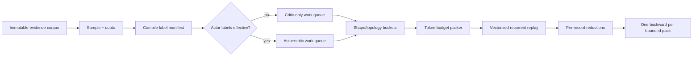

# Liveness / failure-credit replay 正式优化方案 v1

状态：设计与基线测量完成；未改变生产训练语义。  
基线：v32 `run-481995a5-0221-4f59-9293-9105cd336068`，最近 500 次 learner update。  
可复现输出：

- `packages/rl-agent/scripts/benchmark_liveness_replay.py`
- `sts2_mcp_artifacts/runtime/analysis/v32-liveness-replay-benchmark-last500.json`
- `sts2_mcp_artifacts/runtime/analysis/v32-liveness-replay-benchmark-last500.md`

## 1. 结论

当前瓶颈不是 replay 抽样锁，也不是 optimizer，而是 **failure-credit
记录被逐条重放、逐条 backward**：一个更新固定抽 4 条记录，第一条
`RISK_SEQUENCE` 配额记录通常携带接近 256 步的上下文；当前执行器为它逐
时刻调用整套实体 Transformer / recurrent model，并单独构图和反传。

最近 500 次更新的事实基线：

| 指标 | 均值 | 中位 | p90 | p99 |
|---|---:|---:|---:|---:|
| learner total | 19.46 s | 15.91 s | 28.55 s | 59.92 s |
| backward envelope | 17.91 s | 15.04 s | 24.67 s | 57.81 s |
| liveness replay | **12.86 s** | **8.90 s** | **17.80 s** | **50.82 s** |
| episodic replay | 4.30 s | 4.24 s | 6.35 s | 7.91 s |
| online recurrent forward | 1.40 s | 0.49 s | 3.05 s | 4.72 s |

因此 liveness replay 占总更新时间均值的 **66.1%**，占 backward envelope
的 **71.8%**。第一 replay slot 单独平均 10.67 s；其平均工作量为 249.7
步、997.9 candidates、13.7 个 TBPTT segments。其他三个 slot 单条约
0.5--0.85 s。记录耗时与步数的相关系数为 0.695，与 candidates 为 0.663。

另外，500 次更新中 350 次（70%）没有任何 liveness actor label，且
`liveness_policy_gradient_norm == 0`；它们仍消耗了 4544.7 s liveness
replay 时间。这里不能误称整个时间都“无用”：critic 和 shared trunk 仍有
监督；真正可省的是 policy logits/log-softmax、actor loss bookkeeping，以及
不必要的 actor graph 边。

host replay 同样处于饱和状态：2,142,503,956 / 2,147,483,648 bytes；当前
180 条记录均值 11.9 MiB，历史最大单条 176.1 MiB，按最大记录只能容纳
12 条。2 GiB 修复了早先 512 MiB 的严重饥饿，但没有解决每条记录内部大量
重复 snapshots/semantic identity 的数据布局问题。

### 1.1 75k -> 100k 质量崩塌不是 replay 工作量突增，而是 actor freshness 崩塌

同一 v32 lineage 的 held-out 从 75,878 步 `12/16` 通关、deadlock `1/16`
变为 100,105 步 `0/16` Act 1 clear、deadlock `16/16`。按训练区间重建
failure-credit 信号后：

| 区间 | actor-label 为零的更新 | risk actor labels 中位 | lag-suppressed labels 中位 | policy gradient 中位 | risk quota fresh / deficit |
|---|---:|---:|---:|---:|---:|
| 50k--75k | 33.8% | 188 | 3 | 1.24e-4 | 271 / 138 |
| 75k--90k | 46.7% | 172 | 224 | 2.08e-4 | 128 / 112 |
| 90k--100k | **87.3%** | **0** | **224** | **0** | **23 / 151** |

这里的 policy lag 不是在线 rollout queue 突然变旧：在线
`maximum_policy_lag` 均值反而由 5.58 降到 5.25，最大始终 9。变旧的是
episode-boundary failure evidence；90k--100k 虽有约 15.6 条 risk records、
13.5 条 unresolved records 可供选择，但 173 次更新中只有 23 次能满足 fresh
risk actor quota，151 次 quota deficit。`policy_gradient_max_lag=128` 之外的
记录仍可训练 critic，却不再训练 actor。

其他 actor 通道没有接棒：90k--100k direct policy labels 合计仅 3 个，cycle
和 contrast 恒为 0；截至结束 matched pair 仍为 0。虽然 replay 中 direct
witness 从 0 增至 2 条，但 direct quota 配置为 0，累计
`sampled_direct_actor_fresh_count` 仍为 0。

与此同时 critic 没有停：critic gradient norm 中位约 0.0283，均值从
75k--90k 的 0.0482 上升至 0.0897。校准期已经结束，所以 critic 会继续更新
shared trunk，而绝大多数 update 没有 liveness actor gradient 与之配平。这是
75k 后行为漂移最强的日志/代码一致嫌疑：**不是“没有 failure records”，而是
records 过旧后退化成 critic-only，唯一有量的 risk actor 通道基本关闭。**

不能把这一相关性写成已证实的单一因果；在线 V-trace 与 episodic loss 仍同时
更新策略。正式归因实验应从 75,878 checkpoint 做相同 seed 的三臂短跑：

1. frozen failure-credit（只保留在线/episodic）；
2. critic-only failure-credit；
3. fresh actor+critic（缩短 evidence lag 或提高 fresh publication rate）。

逐 checkpoint 配对评估即可判断 shared-critic drift 与 actor freshness 哪一项
造成退化。

工作量没有对应突变，排除了“100k 前突然出现更重 256-step record”这一解释：

| 区间 | liveness mean | slot-0 mean / median | slot-0 steps mean / median | candidates mean |
|---|---:|---:|---:|---:|
| 75k--90k | 13.59 s | 11.25 / 7.27 s | 256 / 256 | 1,565/update |
| 90k--100k | 12.67 s | 10.43 / 7.05 s | 237.9 / 256 | 1,347/update |

也就是说，长 256-step slot 一直存在且一直昂贵，但 90k 后它反而略轻；性能
崩塌与有效 actor credit 消失同步，而不是与 replay latency/shape 爆炸同步。

### 1.2 100k 的 16/16 deadlock 是一个确定的跨页面宏事务坍塌

逐决策重放 `evaluation-step-000100000.jsonl` 后，16 个 held-out seed 的终止
循环完全相同，不是 16 种随机 liveness 故障：

```text
REST_SITE: choose_rest_option(index=1, upgrade)
  -> CARD_SELECTION: select_card
  -> CARD_SELECTION: cancel_selection
  -> REST_SITE
  -> repeat
```

每局都由通用 deadlock detector 记录 `cycle_span=3, occurrences=8`。升级动作
概率通常约 0.996--1.000，取消动作概率约 0.868--1.000；不同 seed 只改变被
选择升级的卡。75k checkpoint 几乎总选 `index=0, rest`，因而没有进入升级
overlay；已有的 cancel 偏置没有暴露。100k 不是模型整体突然不会玩，而是
`rest -> upgrade overlay -> cancel -> rest` 这条宏事务的三个局部偏好同时饱和。

固定选择事务 probe 把先后关系分得更清楚：70,652 步时 selection 页已经是
cancel 94.8% / confirm 5.2%，80,086 为 cancel 99.35%，90,152 为 cancel
98.55%，100,105 仍为 cancel 84.1%。真正让它从潜伏缺陷变成 16/16 deadlock
的是休息点策略在 90k 的 rest 93.1% 翻转为 100k 的 upgrade 88.6%。因此：

- 回滚或压低 upgrade 只能绕开循环，不能修复 selection commit；
- 只给最终 deadlock `-1` 仍无法区分 upgrade、select、cancel 三步如何组合；
- replay 必须保存原子三边失败证据，并配对同一选择事务中走
  `select -> confirm -> durable deck commit` 的 completion counterpart。

这也说明现有 dashboard 分类需要修正。`selection_action_cycle` 只统计同一选择
页面内的 select/deselect，事件子类只统计事件页；这个循环跨 `REST_SITE` 与
`CARD_SELECTION`，不能归入任一单页面子类。应新增：

- `cross_surface_macro_cycle_episode_count`；
- 规范化 `surface/action` period 的 top-k histogram；
- `detected_by_runtime_but_missing_from_failure_evidence` 计数。

不能把它笼统显示成“deadlock 上升”，否则会遮蔽这是单一策略坍塌。

### 1.3 语义内核可以识别该循环；真正断点在发布、freshness 与采样保障

用 held-out seed `10000001` 的真实 journal snapshots（steps 117--123）离线
喂给当前 `DecisionSemanticsKernel + FailureCreditEpisodePipeline`，六个转移都
被分类为 `CONTROL_MOVE`。第二个完整三边 period 闭合时，pipeline 立即产生：

```text
WitnessKind.MULTI_EDGE_CYCLE
strata = {MULTI_EDGE_CYCLE, RISK_SEQUENCE}
attributed policy steps = (120, 121, 122)
streamed_records = 1
```

所以该案例不是 root/overlay 语义身份缺失，也不应被降级为
`UNRESOLVED_STALL`。当前 detector 对它具备正确表达能力。正式回归测试必须把
这六个真实结构的快照固化成最小 fixture，并断言：

1. 六次 receipt 全为 `CONTROL_MOVE`；
2. 第六次选择后、不等 episode 终止，就 drain 一条 fresh multi-edge record；
3. attributed steps 只包含第二个 period 的三次策略选择；
4. compiler 生成一个**原子三边 cycle loss**，而不是三个独立 AVOID 标签。

最后一点是因果边界：`choose upgrade`、`select card`、`cancel` 单独都可能是合法
动作；错误是它们的联合周期。独立惩罚三个动作会误伤正常升级事务。actor
目标应把三个动作保留为可审计的动作级 rows、但按一个原子 group 最小化三边
联合 log-likelihood；同时优先与成功完成升级的 matched outcome 对比。这样
既能把梯度传到每个实际选择，又不会把其中任一动作永久标为全局 AVOID，更
不能写死“总是 rest”或“禁止 cancel”。

但 v32 配方把 `multi_edge_cycle_quota=0`，4 个 sample slots 已固定给 risk、
unresolved、completion、matched（matched 缺失时随机补位）；replay 结束时虽
有 2 条 multi-edge record，累计 fresh multi-edge actor sample 仍为 0。换言之，
**证据类型存在，不等于 learner 获得该证据。** 结合 90k--100k 的 risk
freshness 崩塌，这个三边周期没有可靠的策略压制通路。

正式方案不能简单把第五种 quota 塞进仍为 4 的固定 slots，而应在 executor v2
同步引入两层预算：

1. **因果 actor budget**：direct/multi-edge/matched 等稀有、fresh、可归因记录
   只要存在，至少保留一个 actor slot；multi-edge streamed record 要在有限
   policy-version TTL 内优先消费；
2. **critic work budget**：risk/unresolved/completion 按 replayed candidates /
   steps 打包，不以固定记录数挤占稀有 actor evidence。

训练与 held-out 还必须分开：held-out journal 只用于诊断，绝不能反写 replay。
需要在在线 collector 中记录相同的规范化三边 signature，并把
`cycle_detected -> record_published -> sampled_actor_fresh -> actor_gradient_nonzero`
四段 lineage counters 串起来；任何相邻计数断裂都应直接在面板报警。

## 2. 当前路径分解

### 2.1 sample / lock

`BoundedFailureCreditReplay.sample()` 的 publication lock 只用于抓取一个
immutable corpus 引用与更新计数；quota 和 RNG 选择在 publication lock
之外执行，但仍由独立 `_sample_lock` 串行化。actor 的 `put_many()` 在锁外
构建候选 corpus，最后 CAS 式发布。这一锁边界是合理的。

当前 corpus 只有约 180 条记录，采样是 O(live records) 的 Python 扫描；在
没有 `failure_credit_sampling_ms` 之前不能武断宣称它为零，但它不可能解释
每更新 12.86 秒、且耗时与 replay steps 强相关的现象。应补 telemetry，
不应先重写锁。

### 2.2 encode / H2D / forward

`credit_plan_liveness_losses()` 已经能把**同一次调用内**的多个 context 按
局部 timestep 合批，且 candidate tensor 是 active shape。但生产 learner
对每条记录单独调用它，跨记录完全没有 timestep batching。每个 timestep
还会重新执行：

1. Python tuple/context 查找；
2. `collate_encoded_snapshots()`；
3. CPU -> GPU tensor materialization/copy；
4. 完整模型 forward；
5. 需要目标行时再求 policy log probabilities。

256-step 风险记录因此产生数百个小 batch kernel，而不是少数较宽 batch。
这与 GPU 利用率低、wall time 高完全一致。

### 2.3 backward / microbatch

当前固定 `liveness_records_per_autograd_batch = 1`，每条记录立即 backward，
再处理下一条。它把 activation 峰值限制为一条记录，优点是不会构造
`4 x 256` 的大图；代价是：

- 四次独立 graph traversal / launch；
- context/timestep 无法跨记录合批；
- replay slot 0 的长图独占绝大多数 update 时间；
- 记录数是内存代理，但没有直接按 tokens/candidates/segments 控制真实显存。

TBPTT 每 16 步 detach hidden，已经切断跨 window 梯度；但是一个 record 的
所有 detached segments 最终仍通过一次 record objective backward。后续应
按 segment pack 管理显存，而不是继续把“记录条数”当作唯一界限。

### 2.4 completion / risk 混采

v32 quota 顺序是 risk、unresolved stall、completion control、matched pair；
matched pair 为空后第四条随机补齐。完成控制是有价值的零风险 critic 负样本，
但 `liveness_completion_policy_weight = 0`，不应走 actor head。risk/stall 记录
只有在 policy freshness、phase 和 row eligibility 均成立时才应走 actor。
现在两类记录共用同一路径，导致 70% 更新产生零 policy-head gradient。

## 3. 目标执行架构



### 3.1 先做 executor v2，不先改奖励语义

第一阶段保持 v5 EvidenceRecord/CreditPlan、抽样 RNG、quota、目标、权重、
TBPTT=16 与“每条记录等权”全部不变，只替换执行器：

1. 一次性编译四条 record manifest；
2. 按 label topology 分为：
   - critic-only completion/control；
   - risk actor + critic；
   - direct/cycle actor + critic；
   - matched outcome contrast；
3. 再按 `prefix-length bucket x active-candidate bucket x context-count`
   分桶；
4. 用显式 work budget 打包，而不是固定 record count：
   `sum(replayed_candidates)`, `sum(replayed_steps)`, `max(prefix)`,
   `sum(autograd_segments)`；
5. 同 pack 的 contexts 在每个 timestep 合并调用模型；
6. loss 必须先按 `record_id` 做 reduction，再对记录取均值。

不能直接把异构记录扔给现有 `credit_plan_liveness_losses(plans)` 后使用全局
label mean，因为 label 多的长记录会得到更高权重，改变当前 objective ABI。
正式实现应让 unreduced row/group loss 都带 `record_id`，用 scatter reduction
计算：

```text
record_loss[r] = sum(row_losses where record_id=r) / labels_in_record[r]
batch_loss = mean(record_loss[r])
```

cycle/contrast 等 group loss 也必须按拥有它的 record 归约。仓库新增的窄回归
测试已证明：对于 label topology 完全相同的四条记录，现有多-context replay
将 model forward 从 4 次降为 1 次，loss 与所有 parameter gradients 保持一致。
这验证了跨记录 timestep batching 的可行性；异构 per-record reduction 是正式
实现必须补齐的下一步。

### 3.2 actor / critic 正式分流

manifest 是唯一准入真相；不要根据 stratum 名称猜测 actor 是否有效。每个 pack
在 forward 前生成 `requested_outputs`：

- critic-only：state liveness value + candidate liveness Q；
- actor+critic：上述输出 + policy logits/log-probabilities；
- contrast/cycle：仅在对应 group effective 时保留 actor graph。

模型需要一个受测试的 head-selection API。critic 仍可反传 shared world/
candidate trunk；“跳过 actor”绝不等于 detach critic trunk。只跳过 policy
head、log-softmax 与无 actor loss 的边。这个变化不新增参数，但属于 model
forward ABI 变化，必须纳入 config/checkpoint ABI。

### 3.3 recurrent state 与 segment packing

不要把 collector 存下来的旧 policy hidden 当作“当前模型精确 hidden”。hidden
会随参数更新漂移。正式契约如下：

- persistent `initial_recurrent_state` 仍是行为策略采集时的事实起点；
- burn-in 仍由当前 learner 模型 no-grad 重建，用于减轻 state staleness；
- **同一次 update 内**，重合 context prefix 的 no-grad hidden 可缓存并被多个
  evidence target 共享；
- TBPTT window 起点的当前-update hidden 可以作为 ephemeral stored state，
  不进入 exact-resume checkpoint；
- 若将 segment anchor hidden 持久化，必须显式记录 producer policy version，
  并只作为 R2D2 风格 burn-in seed，不得宣称与当前模型精确等价。

由于 TBPTT window 已 detach，local critic/risk/direct loss 可以按 window pack
并及时 backward 释放图。跨 window 的 cycle group 需要单独的 actor pack，或
保留其所需 logits，不能为了省内存破坏 cycle objective。

## 4. replay v6 数据布局

executor v2 验证后，再改 replay 存储，而不是把两类风险一次混在一起。

### 4.1 去重所有权

当前每条 `EvidenceRecord` 拥有完整 `LearningContext`；同一 episode 的 completion
controls 与 stall incidents 会重复保存相同/重叠 snapshots 和 semantic keys。
v6 应拆为：

```text
ContextBlobStore
  context_blob_id
  episode_id, policy version range
  initial recurrent state
  columnar encoded snapshots + offsets
  interned semantic identity dictionary

EvidenceRecordV6
  incident facts / witnesses / provenance
  context slices: (context_blob_id, start, stop, burn_in)
  target rows/groups referencing local step offsets
```

一份 context blob 可被多条 evidence record 引用；eviction 使用引用计数，最后
一个 record 离开时才释放 blob。matched pair 原子性保留在 record 层。

### 4.2 columnar snapshot

把每步 Python object tree 改为 typed columnar arrays：world/candidate/local
features、IDs、offsets、mask、selected action、behavior log-prob、policy version
分别连续存储；候选长度由 offsets 给出。对审计需要的 exact/loop/comparison
identity 使用 run-local intern table，record 只保留 integer IDs；完整 digest 和
规范化 payload 只存一次。

这既压 host replay，又使 collate 能直接切片/拼接；不能删除 collision-auditable
identity，也不能用不透明 hash 取代当前 fail-closed 语义。

## 5. lock 与并发边界

保留现在的 immutable snapshot + CAS publication 模型。v6 只做三项改动：

1. sample 在 `_sample_lock` 内只进行 RNG/quota/record-id 选择；返回 record/blob
   的 immutable references；tensor packing 在任何 replay lock 之外；
2. corpus 维护按 stratum、actor-potential、policy-version bucket 的持久索引，
   避免每次 sample 全量重建 fresh 列表；
3. checkpoint 仍按 `_sample_lock -> _lock` 顺序获得一致 corpus/RNG/counters，
   ContextBlobStore 与 record index 作为一个 generation 发布。

## 6. telemetry（优化前必须补齐）

每 update：

- `failure_credit_sample_ms`、corpus size、扫描 IDs 数、锁等待时间；
- `manifest_compile_ms`；
- `snapshot_collate_cpu_ms`、`h2d_ms`；
- `burn_in_forward_ms`、`trainable_forward_ms`、`loss_reduce_ms`、`backward_ms`；
- 每 pack 的 records/contexts/steps/candidates/world tokens/local tokens/TBPTT
  segments；
- critic rows、effective actor rows、actor-suppressed 原因；
- evidence stratum 与 label topology；
- `torch.cuda.max_memory_allocated/reserved`（ROCm 也使用 torch.cuda API）；
- policy/head/shared-trunk gradient norms，按 critic/actor pack 分开。

当前 `liveness_replay_ms` 只能覆盖总区间，无法可靠区分 encode、forward 与
backward；因此本方案不伪造显存或分阶段耗时数字。

## 7. bf16 / torch.compile 的实施顺序

先矢量化再 compile。当前逐 timestep active shape 高度动态且每次只有 1 行，
直接 `torch.compile` 很可能产生多 graph/recompile，收益不稳定。executor v2
用长度 buckets 固定少量 shape 后：

1. compile model forward 的 critic-only 与 actor+critic 两个 callable；
2. 对 bucket 上界做 padding，仍禁止全局按 256 candidates padding；
3. bf16 只用于 attention/MLP matmul，loss reduction、importance ratios、value
   targets 与 recurrent state 边界至少先保留 fp32；
4. 对每种 evidence topology 做 fp32/bf16 loss、gradient cosine 与训练稳定性
   回归；
5. compile cache 不进入 checkpoint，backend/precision 进入 runtime ABI。

## 8. checkpoint ABI 与迁移

建议版本：

- `sts2-failure-evidence-replay-v6`
- `failure-credit-executor-v2`
- `liveness-head-routing-v1`

v5 exact resume 不得静默读为 v6。提供离线、纯函数式
`migrate_failure_replay_v5_to_v6`：完整加载并验证 v5，intern/deduplicate 后重算
storage accounting，输出 source/target SHA-256、record/stratum/target-count 对照
manifest，再由 checkpoint manifest 原子引用。若不做离线 sidecar 迁移，就从
冻结网络权重开启明确的 model-init 新 lineage；不能伪装 exact resume。

executor v2 若不改变 model parameters，网络权重可直接继承；optimizer 是否
继承取决于是否只是执行等价变换。只有在逐参数梯度回归通过后，才允许将其视为
exact continuation；head routing 或 precision 改变数值路径时应先独立实验 lineage。

## 9. 实施阶段

### P0：基线与 telemetry（零语义变化）

- 保留本次 JSONL benchmark；
- 补 sample/compile/collate/H2D/forward/backward/peak-memory timers；
- 固定一组真实 replay sidecar 和 RNG state 作为 benchmark fixture。

### P1：executor v2 等价矢量化

- unreduced losses + `record_id` reduction；
- critic-only / actor+critic 路由；
- topology/shape bucket + work-budget packer；
- current-update no-grad prefix cache；
- 保持 replay v5 数据与抽样完全不变。

#### P1a 已落地（2026-08-04）

第一批生产优化已经完成：

- `liveness_records_per_autograd_batch` 从只允许 `1` 改为允许
  `1..sample_records`；旧配置保持 `1` 时仍走原逐记录边界；
- 一个 pack 的不同 context 按 local timestep 共用 active-shape forward；
- 每条 evidence record 仍先独立生成 mask/target 并独立归约，再做
  equal-record mean；没有改成全局 label mean，长 context 不会取得更大权重；
- 最后一个不足额 pack 按 `pack_records / total_records` 回传，`3+1` 等
  非整除分包与逐记录梯度等价；
- aggregate step/candidate 硬预算仍在第一次 model forward 前 fail closed；
- 256-step target/mask 在 CPU 上组装后一次性传输，不再在逐标签循环中用
  GPU `.item()` 串行同步；
- progress telemetry 同时记录 autograd batch 和兼容的逐 record work；
- v33 尚未产生训练 artifact，因此其显式 model-init 配方启用
  `sample_records=4, liveness_records_per_autograd_batch=4`。v32 及更早
  配方仍为 `1`，不把执行 ABI 改动伪装成旧 checkpoint 的 exact resume。

冻结 v32 `periodic-step-000090152`、同一 replay fixture、RX 7900 XTX、
ROCm 7.2.1、FP32/math-SDPA，`warmup=1, iterations=3` 的实测如下：

为只测 executor packing，两臂均显式固定为旧 synchronizing mask oracle；
因此下表的收益不包含 `kernel-lab-e2e-application-v1.md` 中 branchless mask
另行测得的收益，也不把两个独立 A/B 的百分比机械相乘。

| 指标 | pack=1 | pack=4 | 变化 |
|---|---:|---:|---:|
| liveness replay mean | 12.775 s | 6.047 s | **2.113x / -52.7%** |
| backward envelope mean | 14.540 s | 7.876 s | **1.846x / -45.8%** |
| learner total mean | 14.963 s | 8.331 s | **1.796x / -44.3%** |
| wall E2E mean | 14.994 s | 8.500 s | **1.764x / -43.3%** |
| peak allocated | 3.581 GB | 7.075 GB | +3.494 GB |
| peak reserved / device | 3.592 GB / 13.97% | 7.172 GB / 27.90% | 低于 50% 门禁 |

三次更新后的 `liveness_credit_loss` 完全相同（均
`0.09824787825345993`），总 `gradient_norm` 仅相差
`2.98e-8`。CPU 回归还覆盖异构 actor/critic label、3/5/7/111 candidates
以及 4-record 的 `3+1` 分包。结果保存在外部 artifact：

- `runtime/analysis/liveness-executor-v2-pack1-ab.json`
- `runtime/analysis/liveness-executor-v2-pack4-cpu-targets-ab.json`

这一批已经达到 learner total `<=12 s` 和 updates/hour `>=1.6x` 的目标，
但 liveness 本段仍为 6.05 s，尚未达到原定 `<=5 s`。因此下一优化点应是
critic-only head routing、静态编码预批处理和稳定 shape bucket，而不是继续
无界增加 record pack 或改变训练信号。

### P2：replay v6 去重存储

- ContextBlobStore、columnar snapshot、identity interning；
- v5 -> v6 离线迁移器；
- byte eviction、quota、matched-pair、exact checkpoint 全套测试。

### P3：compile / bf16 / 多 actor

- bucket 稳定后引入两个 compiled callable；
- bf16 数值验收后开启；
- learner wall time 降下来后再增加 collector workers，否则 producer 已经在等
  learner，多 actor 只会继续堆积/阻塞。

## 10. 验收门槛

### 10.1 语义正确性（必须全部通过）

1. fp32、dropout off：旧逐记录路径与新 pack 路径的 total/per-channel loss
   `rtol <= 1e-6, atol <= 1e-7`；
2. 每个 parameter gradient `rtol <= 2e-5, atol <= 2e-6`，并报告 cosine；
3. 异构 label-count 记录仍保持每-record 等权；
4. forced/censored/stale/risk-phase suppression label 数完全一致；
5. direct/cycle/risk/completion/matched pair 每种单独及混合覆盖；
6. 1、2、111、256 candidates active-shape 覆盖；
7. 16-step TBPTT 边界前后、跨 window cycle、2-context matched pair 覆盖；
8. sample RNG、quota deficit 与 incident IDs 在相同 replay/RNG 下不变；
9. v5 exact resume fail-closed；v5->v6 迁移 target counts/identities/bytes 可审计。

### 10.2 性能（同 checkpoint、同 replay fixture、同 GPU）

- liveness replay mean：12.86 s -> **<= 5.0 s**；
- liveness replay p90：17.80 s -> **<= 8.0 s**；
- learner total mean：19.46 s -> **<= 12.0 s**；
- learner updates/hour 至少 **1.6x**；
- actor-zero 更新不再构造 policy log-prob graph；
- worst-case 4-record pack 无 OOM；按本轮明确放宽后的门禁，peak reserved
  必须不高于设备总显存 50%，且 benchmark 超限时以非零状态 fail closed；
- compile recompile 次数在 warmup 后为 0（按 bucket）；
- held-out paired seeds 不允许 liveness/deadlock 指标显著退化。

## 11. 不应做的“优化”

- 不把 256-step context 直接截短来换速度；这会丢因果证据；
- 不因 actor label 为零而删除 critic control；
- 不用全局 256 candidate padding；
- 不把旧 behavior hidden 宣称为当前模型精确 hidden；
- 不把 completion action 写成手工 PREFER；
- 不在没有 per-record reduction 的情况下直接合并异构记录；
- 不先加 actor 数量：当前 rollout producer wait 已表明 learner 是瓶颈。
