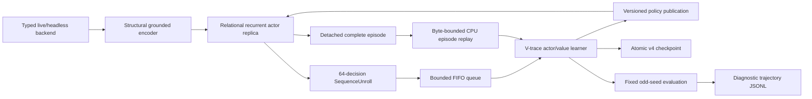

# Relational grounded-candidate V-trace baseline (v4)

This document is the normative architecture for the restarted RL line. The v1
grounded single-step replay learner and the relation-poor v2 recurrent learner
did not establish a useful Act 1 baseline and are not migration sources. Their
checkpoints and metrics may be retained as failure evidence. The original v3
line started from fresh random parameters. The v4 long-horizon successor may
inherit only explicitly validated, shape-compatible shared network tensors from
the selected v3 policy into a new lineage; it never calls that operation exact
resume.

## Scope

The baseline learns directly from the authoritative legal action set exposed by
the typed live or headless environment. It has no MuZero dynamics, MCTS, planner,
demonstration loss, card/boss/route rule, action rewrite, Q head, reward-prediction
head or terminal-prediction head.



## Model

`RecurrentCandidateModel` preserves the reviewed world/candidate separation:

1. `encode_world` reads structural world tokens and the decision domain only.
2. Every world entity carries both a stable definition identity and, where the
   runtime supplies one, a concrete instance/relation identity.
3. `encode_candidates` attends the exact world tokens and separately pools
   exact-instance and same-definition evidence for its source and target. A
   learned projection decides how to combine those four channels; no fixed
   tactical ratio is encoded.
4. Two GRU halves consume candidate-independent state: run memory updates on
   macro decisions, while combat memory updates in combat and is cleared on
   exit. Hundreds of card plays cannot overwrite route/build memory.
5. The recurrent context conditions a masked legal-candidate policy.
6. The legacy scalar value predicts the online V-trace target. Separate
   candidate-independent task and revival-cost values predict combat, Act and
   complete-run horizons without changing the online value ABI.

The default contract is:

- structural feature width: 224;
- world/candidate width: 128;
- world layers: 3;
- latent slots: 12;
- recurrent hidden width: 256;
- parameters: reported by `--dry-run` for the selected optional-head profile;
- output heads: one masked policy, the legacy online scalar value, and
  combat/Act/run task plus non-negative revival-cost values. Optional factual
  transaction effect/delta/Q heads remain profile-controlled.

The model-facing observation uses the versioned
`grounded-relational-runtime-encoding-v8` contract together with the factual
[`grounded-card-facts-encoding-v3`](./card-facts-abi.md) mechanics ABI. Card effects
come from exact runtime `DynamicVar`, keyword, tag and lifecycle facts, not from
description parsing or curated card rules. The default capacity is 2,048 world
tokens and 64 local tokens per candidate. Fact-identical copies in the permanent
deck and public orderless combat piles share one exact counted variant, while
hands, selections, candidates and distinct modified variants stay separate.
Overflow is an error with exact structural diagnostics, never silent
truncation. This encoder change invalidates every earlier checkpoint.

Candidate permutation must permute policy outputs in the same way while leaving
the world encoding, recurrent state and value unchanged. Opaque dispatch handles
are not model inputs. Only the environment legality mask can suppress an action.

### Factual relation coverage

The encoder exposes relationships which a policy would otherwise have to infer
from unstable list positions:

| Relation | Representation |
|---|---|
| same card definition vs. concrete copy | separate `entity_id` and runtime `entity_aux_id` for concrete hand/selection/action entities; exact `quantity` for fact-identical copies in orderless multisets |
| card to dynamic vars, enchantment and affliction | shared concrete relation identity |
| card to Deck/Hand/Draw/Discard/Exhaust/Play | fixed collision-free zone ID plus instance identity |
| play/potion action to source and enemy target | independent source/target definition and relation channels |
| enemy to powers and visible intents | shared enemy relation identity, child definition/role identity |
| potion to inventory slot | factual `slot_index` and potion zone |
| card selection/multi-select | source/destination zone, membership, operation, counts and confirmation facts |
| deck upgrade | original instance bound to its factual upgrade preview |
| shop choice | exact shelf slot, nested item, price, stock and affordability facts |
| rest choice | native option type/enabled state and exact heal amount when supplied by the game |
| reward choice | reward card/relic/potion identity and explicit add/skip mutation family |
| map route | coordinate identities, point/room types and explicit directed edge tokens |
| action consequence | only guaranteed immediate protocol mutation/resource facts; never predicted damage, draws, event results or future RNG |

Draw-pile composition is player-inspectable and is encoded as a canonical
unordered counted multiset; hidden draw order is never exposed. Active map/shop/rest,
reward and selection surfaces are included only where decision-relevant so the
interface does not serialize inactive UI trees on every combat action.

## Training data contract

`SequenceUnroll` is a contiguous recurrent segment. It stores:

- initial recurrent state;
- exact sparse encoded decision snapshots;
- selected candidate indexes;
- behavior log-probabilities;
- immediate scalar rewards and discounts;
- forced-vs-policy decision flags;
- behavior policy version;
- an optional next-state snapshot for value bootstrap.

The final discount is zero exactly at task terminal/deadlock. A positive final
discount requires a bootstrap snapshot. Unrolls are placed in a bounded FIFO and
consumed once. They are never inserted into a generic transition replay.

Two purpose-specific, training-partition-only sidecars are maintained:

1. transaction replay stores factual select/deselect/confirm/cancel sequences;
2. complete-episode replay stores immutable CPU decision snapshots and the
   authoritative result/cost labels backfilled at combat, Act and run boundaries.

The episode sidecar is bounded independently by episode count, total logical
bytes, per-episode bytes and sampled segments per episode. Oversized episodes
are counted and rejected rather than evicting the entire corpus. Win, failure
and censored episodes are sampled in rotating strata. Censored boundaries do
not fabricate success or failure labels, and held-out evaluation never enters
either training replay.

The learner may publish a new policy while a long episode is running, but the
actor adopts it only after emitting a complete recurrent unroll. At episode end
the actor waits for an explicit main-thread acknowledgement, allowing metrics,
periodic checkpointing and held-out evaluation intent to commit before the next
simulator reset.

Each completed unroll also updates one compact actor-progress snapshot with the
current maximum Act/floor, cumulative reward, revivals, HP loss, enemy HP,
hand/draw/discard/exhaust counts, decision surface, legal/selected action-kind
counts, the last selected action, no-net-progress age, and the exact behavior-policy
version. The combat age is now measured from the last meaningful net-health or
phase/wave advance, not the last transient damage event. Learner metrics attach
that snapshot without
writing a verbose per-decision training journal, so an in-flight Act 1--3 run
remains observable without sacrificing simulator throughput.

Default data-plane settings are:

- unroll length: 64 decisions;
- queue capacity: 256 unrolls;
- learner batch: 8 unrolls;
- minimum learner batch: 8 unrolls;
- one actor per typed backend session;
- maximum accepted behavior-policy lag: 1,024 learner versions.

The queue uses producer backpressure rather than eviction. Queue wait time,
occupancy, produced count and consumed count are runtime metrics.

## Learner

The learner replays each unroll recurrently under current parameters and computes
IMPALA V-trace targets from current and behavior action probabilities.
Standard-task defaults:

- discount: 0.997;
- V-trace rho clip: 1.0;
- V-trace trace-c clip: 1.0;
- policy rho clip: 1.0;
- policy loss weight: 1.0;
- value loss weight: 0.5;
- entropy weight: 0.01;
- global gradient norm clip: 1.0.

The native-revival preheat profile uses discount `1.0`, not `0.997`, so its
bounded cumulative survival scores telescope exactly over an episode.

In the preheat profile, each learner update may additionally sample two complete-
episode sequences. The current model reconstructs the exact split-GRU state from
a sparse historical prefix under `torch.no_grad()`: every preceding non-combat
decision needed by run memory, the current combat since its most recent reset,
and at least the configured recent burn-in. Only the contiguous 32-decision
learning suffix retains autograd. Therefore a 10,000- or 30,000-step source run
increases bounded CPU storage and no-grad reconstruction work, but cannot make
accelerator activation memory proportional to the full episode.

Sparse and full replay consume different numbers of otherwise irrelevant model
calls, so training-mode dropout would give them different RNG histories. The
learner therefore evaluates the complete episodic replay forward pass with
dropout disabled, including both prefix and suffix, and restores the model's
previous train/eval mode in a `finally` block. Evaluation mode does not disable
autograd: the short suffix still supplies the bounded learning graph.

Every observed combat/Act/run boundary trains its task value. Revival-cost values
and revival policy credit are success-conditional: a failed or censored horizon
cannot look attractive merely because it used fewer revivals. Selected-action
policy replay uses clipped factual behavior/current probability ratios. The
already-weighted revival signal is capped to a configured fraction of the
absolute primary completion/progress residual until the task value classifies
that successful horizon on the positive side of the signed outcome target and
its residual enters the configured `primary_success_tie_tolerance` band.
Within that narrow learned-success tie stratum, the cap uses at least a small
nominal primary unit. This keeps zero- versus high-revival successful paths
distinguishable after the primary advantage converges to zero. Outside the tie
band, the fractional cap cannot reverse a material primary residual; failed and
censored horizons still receive no revival policy label. A forced singleton
still trains value heads but has no episodic policy term.

Forced singleton actions contribute value/recurrent training but no policy loss
or policy entropy. All tensors, gradients and post-step parameters are checked
for finiteness. The learner reports importance ratios, clipping fraction, policy
lag, target/advantage means and per-stage timing.

## Actor/learner overlap

The actor owns a model replica and backend session in its own thread. It streams
completed unrolls into the queue immediately, so learner updates overlap the rest
of the same environment episode. The learner never mutates the actor module.
Policy snapshots are copied to the actor only at episode boundaries, and every
unroll records the exact behavior-policy version.

When complete-episode replay is enabled, the main thread holds at most one
already-fetched FIFO batch behind the actor. A newer batch proves the retained
batch is not the episode tail; otherwise the factual episode boundary commits
the completed trajectory before that tail batch is learned. This bounded lag
preserves steady-state overlap, never consumes an online unroll twice, and
guarantees that a one-episode run samples its own long-horizon labels before the
final checkpoint. Recorded collection with an odd held-out evaluation seed is
rejected rather than mislabeled as training data.

This replaces both v1 synchronous collection and the experimental one-episode
overlap wrapper. There is one maintained execution mode: bounded FIFO asynchronous
actor/learner overlap.

## Reward and initial curriculum

`sts2-task-reward-v4` has no action-quality or damage heuristic. It combines:

- task success: +1;
- task failure, semantic deadlock or an explicit curriculum horizon: -1;
- for Act/run horizons only, a bounded positive delta in monotonic run
  progress, so a failed run that travelled farther ranks above an early loss.

Combat reward does **not** pay for damage dealt, enemy-HP change, number of
cards played, or any preferred action. Those quantities may remain factual
observations/diagnostics, but they are not reward terms.

The default standard full-run objective and the native-revival preheat objective
are both `run`: entering Act 2 is ordinary forward progress rather than an
artificial episode boundary. Both profiles traverse route, reward, event, shop,
rest, combat, and build decisions until the complete run terminates. The retained
`act1` objective and the `combat` profile are explicit software diagnostics, not
gates or the main training route. Backend reward scalars are not targets.

No human-data cold start is required for this baseline. Human trajectories
may be evaluated later as a separately versioned experiment; they must not be
silently mixed into this baseline.

The optional `preheat` profile is a separate, versioned full-run curriculum. It
adds the game's native `RELIC.LIZARD_TAIL` to the normal starter relic set at a
fresh full-run reset. The simulator-only training controller budgets that same
native death-prevention path across the entire run; `-1` means unlimited and
normal profiles leave it disabled. The relic still performs the game's own
death hook, flash and 50% maximum-HP heal. Only the training copy is re-armed
after it fires.

The simulator exports exact monotonic `training_revivals_used` and
`training_player_hp_lost` counters. HP loss is recorded at `Creature.LoseHp`
from actual HP removed, so overkill is not counted and later healing cannot
erase prior loss. These counters are translated under `observation._training`:
they are reward/evaluation facts and the grounded encoder never sees them.

`sts2-run-survival-efficiency-v4` combines the authoritative typed
`transition.facts.run_result` final run outcome and monotonic
forward run distance with three bounded costs:

- a terminal margin that makes every run victory rank above every failure;
- a cumulative cost for exact player HP lost;
- a cumulative cost for exact native revivals used;
- a small cost per environment decision.

The profile keeps a 30,000-decision outer transport-safety ceiling and uses
undiscounted return. Exact semantic deadlock detection terminates a genuine
reversible UI loop earlier. Separately, a 256-decision combat window requires a
5% net reduction in current enemy-health burden or a real phase/wave advance.
Damage followed by healing and summon churn do not reset the window. A second
256-decision non-combat window advances only on durable run progress: run/room/
event identity, HP/max HP, gold, permanent deck, relic or potion composition,
or completion. Dynamic preview counters, page/option text, screen/phase and
selection membership do not reset it, so changing `HpLoss` values and alternating
select/cancel operations cannot evade the bound. Same-room resource fingerprints
are remembered: a new durable resource state may reset the window once, but a
bounded `A -> B -> A` or multi-state cycle cannot reset it again. These generic
fact boundaries do not branch on any particular card/event ID and contain no
handwritten card, event, preferred-action, damage-estimate, or revival-count
policy. The outer ceiling is not an Act boundary or curriculum gate. All
survival/pace costs together are bounded below one point, so the
terminal margin guarantees every victory ranks above every failure. Forward
floor progress gives failed runs useful ordering without paying for damage or
specific choices. Within the same outcome the weighted objective prefers:

1. finish the run and travel farther;
2. lose less player HP and consume fewer revivals;
3. finish in fewer decisions.

This is not an invincibility/no-consequence dataset and it does not supervise
random actions as correct. Epsilon exploration uses revival as a safety net to
reach later map, build, reward, event, shop, rest, elite, and boss decisions;
Online V-trace trains policy and value from the configured shaped return. The
complete-episode sidecar separately gives decisions beyond one short unroll an
authoritative combat/Act/run outcome and forward-progress target. Revival
efficiency remains a subordinate success-conditional objective. Evaluation
reports run/Act-1 success, floor, decision count, exact HP lost, revivals used,
revival-free success, and successful completion with at most one revival.

WSL/ROCm preheat starts the native-revival full game directly. There is no
random-combat, Act-1, Act-2 or Act-3 behavior gate in the launch path. Act
crossings and the real terminal outcome are metrics from the same uninterrupted
episode, not prerequisites that repeatedly rerun parts of the game. The short
formal preflight verifies the pinned simulator identity, runtime-mechanics
schema and one real event-to-combat transport path; it does not score actions or
truncate the training curriculum.

Learner collation pads only to the largest active world/candidate/local shape
in each batch. The configured 2048/256/64 capacities remain fail-closed input
limits, but are not paid on every small decision. The preheat profile uses
16-step recurrent unrolls in batches of four so an initial ROCm update completes
before the asynchronous collector can accumulate hours of unusable rollout.

## Deadlock diagnostics

Evaluation canonicalizes the complete observation and legal candidates after
removing only transport identities such as request UUIDs, dispatch handles,
timestamps and revision counters. Repeated semantic decision/action pairs in a
bounded window produce explicit `DeadlockEvidence` and terminate the task as a
failure. Combat and non-combat progress trackers independently catch changing-
state loops that cannot recur under an exact semantic fingerprint.

These are generic loop detectors, not card/UI/boss heuristics. A combat-progress
termination populates `EpisodeMetrics.stall_evidence` exactly once; every
non-stall episode leaves it null. The bounded mapping records the tracker anchor,
current and required net-HP progress, hand/draw/discard/exhaust counts, legal
action-kind counts, and at most eight stable hand-card IDs with explicit
playability when the bridge provides it. The same mapping is attached to the
existing terminal anomaly record; no additional per-decision payload or rolling
card history is retained.

Trajectory journal v3 writes a compact record for every held-out decision,
including position, resource/entity counts, selected action, candidate-kind
counts, policy top-k, value and reward. Complete semantic observation/candidate
snapshots are bounded to the first and last decision, every 256 decisions,
anomalies, and the preceding eight-decision context. Journals are diagnostic
artifacts and never enter the rollout queue.

Trajectory journal v3 is a record union rather than the v2 full-state row:

- `event=decision`, `record_kind=summary` is the one-per-decision compact row.
  It uses `observation_summary` plus action counts/fingerprints and does not have
  top-level `observation` or `legal_actions`. Long scalar strings are represented
  by a bounded prefix, UTF-8 length and SHA-256 digest.
- `event=decision_snapshot`, `record_kind=rich_snapshot` carries complete
  semantic `observation`, `legal_actions` and `selected_action`, plus
  `snapshot_reasons`. When a progress stall is detected on the transition
  result it also carries `result_step_index`, semantic `result_observation` and
  `result_legal_actions`, and result terminal flags; the pre-action decision is
  retained rather than silently replaced.
- Consumers should identify a record by `(episode_id, step_index, record_kind)`.
  A decision normally has one summary and may also have a rich snapshot. Context
  snapshots are appended only when a later anomaly is detected, so file order is
  append order rather than guaranteed `step_index` order; reconstruct a timeline
  by grouping by episode and sorting numerically by step. If more than one rich
  snapshot exists for the same step, merge the union of `snapshot_reasons` and
  retain the last payload. A first/periodic snapshot that already covers a later
  anomaly-context step is reused rather than duplicated, so its original reason
  remains while its payload still satisfies the context window.

The backend contract treats each returned `EnvironmentResult` and all nested
DTOs as immutable after return. This allows the journal to retain read-only
references for its eight-record anomaly context without reintroducing a full
deep copy on every held-out decision. The built-in headless and live backends
construct a new decoded result for every state.

## Evaluation schedule

Training seeds are even; held-out evaluation seeds are odd. The default v4 gates
are steps 0, 10,000, 25,000 and 50,000, with fixed seeds and deterministic policy.
Reports include:

- Act 1 clear count and rate;
- Act 3 reach count and rate;
- run/combat win rate as applicable;
- semantic deadlock rate;
- combat and non-combat progress-stall rates;
- maximum active legal-candidate count observed by the held-out batch and run;
- mean and maximum floor;
- mean maximum act;
- mean undiscounted reward.
- for revival preheat, mean exact player HP lost, mean revivals used,
  revival-free Act-1/run success rates, Act-1 boundary HP/revival means,
  successful-run conditional HP/revival means, run wins with at most one
  revival, and full-run progress.

No Act 1 performance claim is valid without these held-out evaluations and their
trajectory journals.

The native-revival preheat profile evaluates 12 fixed held-out seeds at step
zero (including after model-parameter initialization) and at 30k/100k/250k.

## Checkpoint ABI

The format is `sts2-recurrent-vtrace-checkpoint-v4` and contains:

```text
metadata.json
network.pt
actor_network.pt
optimizer.pt
rollout_queue.pkl
stochastic_state.pkl
transaction_replay.pkl   # when transaction learning is enabled
episodic_replay.pkl      # when complete-episode learning is enabled
checkpoint.manifest.json
```

Publication is atomic and SHA-256 covers every payload. Exact resume validates
the contract/reward/dependency identities, model and encoding config, learner and
actor tensor specifications, optimizer layout, pending unrolls, devices, RNGs,
both enabled replay corpora (including sampler RNG/counters/capacities), and
collector continuation state before mutating live resources. Every payload is
probed against independent temporary objects before live resources are mutated.
Old checkpoints containing `replay_buffer.pkl` are rejected; there is no v1
compatibility loader and a v3 checkpoint is not an exact-resume source for v4.

`--initialize-from` is a different, explicit operation. When the learned tensor
shapes and grounded feature ABI are unchanged, capacity/config changes such as
`max_candidates = 96` to `256` may import the learner network into a fresh
lineage. For an explicitly recognized v3 source, all six long-horizon head
prefixes must be absent as one complete group; those target heads remain freshly
initialized while every inherited tensor must match exactly by name, shape and
dtype. Optimizer state, queued unrolls, RNGs, collector continuation, counters,
both replay corpora and policy-version numbers are not imported. Child checkpoint provenance uses
the `model_parameter_initialization` relation, so this cannot be confused with
exact resume.

Checkpoint provenance describes the operation that actually produced each
checkpoint. The first checkpoint of a process retains `fresh`, `exact_resume`,
or `model_initialization`; later periodic/final checkpoints in that same process
use `in_process_successor` and point to the immediately preceding checkpoint.
`maximum_observed_candidates` is a diagnostic training-state scalar; a legacy v3
checkpoint missing only that field may initialize it to zero, while every other
unknown or missing state field remains fail-closed.

Non-fresh provenance is itself fail-closed: before publication, the direct
parent must be an existing atomic training checkpoint with a complete manifest,
all payload sizes and SHA-256 hashes valid, no unlisted files, matching manifest/
metadata checkpoint UUIDs, and current contract, reward and dependency-lock
identity. A non-empty path is not accepted as lineage evidence by itself.

## Commands

```powershell
Set-Location .\packages\rl-agent
python -m ruff check sts2_rl sts2_baseline launcher.py launcher_watchdog.py
python -m mypy sts2_rl sts2_baseline
python -m pytest tests -q -p no:cacheprovider
python -m sts2_rl.train --dry-run

# Optional combat transport diagnostic
python -m sts2_rl.train --profile combat --sim-exe <PINNED_RELEASE_EXE>

# Native-revival full-run knowledge preheat (Windows CPU)
python scripts/audit_card_fact_coverage.py --sim-exe <PINNED_RELEASE_EXE>
python scripts/audit_runtime_mechanics_coverage.py --sim-exe <PINNED_RELEASE_EXE>
python -m sts2_rl.train --profile preheat --sim-exe <PINNED_RELEASE_EXE>

# Native-revival knowledge preheat (WSL/ROCm; refuses CPU fallback)
wsl.exe -- bash -lc 'export STS2_ARTIFACT_ROOT=<WSL_ARTIFACT_ROOT>; cd <WSL_REPOSITORY_ROOT>/packages/rl-agent; bash scripts/train_preheat_wsl_rocm.sh'

# Main Act 1 baseline
python -m sts2_rl.train --profile default --sim-exe <PINNED_RELEASE_EXE>
```

Mutable output must remain below `STS2_ARTIFACT_ROOT`, outside the source tree.
Formal headless runs require the pinned Release simulator and identity sidecar.
They also run the native catalog and event-to-combat runtime-mechanics preflight
before backend launch. See [`runtime-mechanics-abi.md`](./runtime-mechanics-abi.md).
