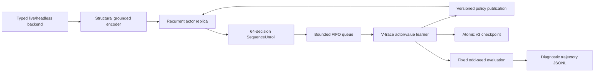

# Recurrent grounded-candidate V-trace baseline (v2)

This document is the normative architecture for the restarted RL line. The v1
grounded single-step replay learner did not clear Act 1 and is not a migration
source. Its checkpoints and metrics may be retained as failure evidence, but v2
starts from fresh random parameters and rejects the v1 checkpoint ABI.

## Scope

The baseline learns directly from the authoritative legal action set exposed by
the typed live or headless environment. It has no MuZero dynamics, MCTS, planner,
demonstration loss, card/boss/route rule, action rewrite, Q head, reward-prediction
head or terminal-prediction head.



## Model

`RecurrentCandidateModel` preserves the reviewed world/candidate separation:

1. `encode_world` reads structural world tokens and the decision domain only.
2. `encode_candidates` grounds each currently legal candidate against the world
   latents without candidate-position embeddings.
3. A GRU consumes the candidate-independent state embedding and the previous
   recurrent state.
4. The recurrent context conditions a masked legal-candidate policy.
5. One scalar value predicts the configured task horizon.

The default contract is:

- structural feature width: 160;
- world/candidate width: 128;
- world layers: 3;
- latent slots: 12;
- recurrent hidden width: 256;
- parameters: 3,971,778;
- output heads: masked policy and scalar value only.

Candidate permutation must permute policy outputs in the same way while leaving
the world encoding, recurrent state and value unchanged. Opaque dispatch handles
are not model inputs. Only the environment legality mask can suppress an action.

## Training data contract

`SequenceUnroll` is a contiguous recurrent segment. It stores:

- initial recurrent state;
- exact sparse encoded decision snapshots;
- selected candidate indexes;
- behavior log-probabilities;
- immediate scalar rewards and discounts;
- forced-vs-policy decision flags;
- behavior policy version;
- an optional next-state snapshot for value bootstrap.

The final discount is zero exactly at task terminal/deadlock. A positive final
discount requires a bootstrap snapshot. Unrolls are placed in a bounded FIFO and
consumed once. There is no replay capacity measured in transitions, recent mix,
coverage mix, priority, TD-error refresh, resampling, demonstration partition or
backfill.

Default data-plane settings are:

- unroll length: 64 decisions;
- queue capacity: 256 unrolls;
- learner batch: 8 unrolls;
- minimum learner batch: 8 unrolls;
- one actor per typed backend session;
- maximum accepted behavior-policy lag: 1,024 learner versions.

The queue uses producer backpressure rather than eviction. Queue wait time,
occupancy, produced count and consumed count are runtime metrics.

## Learner

The learner replays each unroll recurrently under current parameters and computes
IMPALA V-trace targets from current and behavior action probabilities.
Standard-task defaults:

- discount: 0.997;
- V-trace rho clip: 1.0;
- V-trace trace-c clip: 1.0;
- policy rho clip: 1.0;
- policy loss weight: 1.0;
- value loss weight: 0.5;
- entropy weight: 0.01;
- global gradient norm clip: 1.0.

The native-revival preheat profile uses discount `1.0`, not `0.997`, so its
bounded cumulative survival scores telescope exactly over an episode.

Forced singleton actions contribute value/recurrent training but no policy loss
or policy entropy. All tensors, gradients and post-step parameters are checked
for finiteness. The learner reports importance ratios, clipping fraction, policy
lag, target/advantage means and per-stage timing.

## Actor/learner overlap

The actor owns a model replica and backend session in its own thread. It streams
completed unrolls into the queue immediately, so learner updates overlap the rest
of the same environment episode. The learner never mutates the actor module.
Policy snapshots are copied to the actor only at episode boundaries, and every
unroll records the exact behavior-policy version.

This replaces both v1 synchronous collection and the experimental one-episode
overlap wrapper. There is one maintained execution mode: bounded FIFO asynchronous
actor/learner overlap.

## Reward and initial curriculum

`sts2-task-reward-v3` has no action-quality or damage heuristic. It combines:

- task success: +1;
- task failure, semantic deadlock or an explicit curriculum horizon: -1;
- for Act/run horizons only, a bounded positive delta in monotonic run
  progress, so a failed run that travelled farther ranks above an early loss.

Combat reward does **not** pay for damage dealt, enemy-HP change, number of
cards played, or any preferred action. Those quantities may remain factual
observations/diagnostics, but they are not reward terms.

The default standard full-run objective is `act1`: entering Act 2 is success and
dying or deadlocking before Act 2 is failure. The native-revival preheat uses the
longer `run` objective so it traverses route, reward, event, shop, rest, combat,
and build decisions instead of terminating at the first Act boundary. The
`combat` profile remains only an optional software diagnostic. Backend reward
scalars are not targets.

No human-data cold start is required for the first v2 baseline. Human trajectories
may be evaluated later as a separately versioned experiment; they must not be
silently mixed into this baseline.

The optional `preheat` profile is a separate, versioned full-run curriculum. It
adds the game's native `RELIC.LIZARD_TAIL` to the normal starter relic set at a
fresh full-run reset. The simulator-only training controller budgets that same
native death-prevention path across the entire run; `-1` means unlimited and
normal profiles leave it disabled. The relic still performs the game's own
death hook, flash and 50% maximum-HP heal. Only the training copy is re-armed
after it fires.

The simulator exports exact monotonic `training_revivals_used` and
`training_player_hp_lost` counters. HP loss is recorded at `Creature.LoseHp`
from actual HP removed, so overkill is not counted and later healing cannot
erase prior loss. These counters are translated under `observation._training`:
they are reward/evaluation facts and the grounded encoder never sees them.

`sts2-run-survival-efficiency-v3` combines the final run outcome and monotonic
forward run distance with three bounded costs:

- a terminal margin that makes every run victory rank above every failure;
- a cumulative cost for exact player HP lost;
- a cumulative cost for exact native revivals used;
- a small cost per environment decision.

The profile caps a complete run at 10,000 decisions and uses undiscounted
return. All survival/pace costs together are bounded below one point, so the
terminal margin guarantees every victory ranks above every failure. Forward
floor progress gives failed runs useful ordering without paying for damage or
specific choices. Within the same outcome the weighted objective prefers:

1. finish the run and travel farther;
2. lose less player HP and consume fewer revivals;
3. finish in fewer decisions.

This is not an invincibility/no-consequence dataset and it does not supervise
random actions as correct. Epsilon exploration uses revival as a safety net to
reach later map, build, reward, event, shop, rest, elite, and boss decisions;
V-trace trains policy and value from run outcome, forward distance, survival,
and pace consequences. Evaluation reports run/Act-1 success, floor, decision
count, exact HP lost, revivals used, and revival-free success rates.

Before WSL/ROCm training starts, a fail-closed random-policy gate runs 500
combat smoke episodes, a separate `TUNNELER_WEAK` stress probe, and three
complete-flow traversal episodes. It requires at least two native revivals
within one uninterrupted combat, verifies exact counter deltas and enemy
continuity across revival, rejects any non-terminal zero-action state, and
requires at least a 99% typed combat victory rate. Every full-run probe must
inject the native relic/budget, retain monotonic run-scoped counters, exercise
build/combat/route domains, and enter Act 2. The combat portion also protects
the `combat_post_end_pending -> combat_victory` adapter boundary.

## Deadlock diagnostics

Evaluation canonicalizes the complete observation and legal candidates after
removing only transport identities such as request UUIDs, dispatch handles,
timestamps and revision counters. Repeated semantic decision/action pairs in a
bounded window produce explicit `DeadlockEvidence` and terminate the task as a
failure.

This is a generic loop detector, not a card/UI/boss heuristic. Evaluation writes
versioned JSONL with compact observations, legal actions, selected action, policy
top-k, value, reward breakdown and deadlock evidence. These journals are
diagnostic artifacts and never enter the rollout queue.

## Evaluation gates

Training seeds are even; held-out evaluation seeds are odd. The default v2 gates
are steps 0, 10,000, 25,000 and 50,000, with fixed seeds and deterministic policy.
Reports include:

- Act 1 clear rate;
- run/combat win rate as applicable;
- semantic deadlock rate;
- mean and maximum floor;
- mean maximum act;
- mean undiscounted reward.
- for revival preheat, mean exact player HP lost, mean revivals used,
  revival-free Act-1/run success rates, and full-run progress.

No Act 1 performance claim is valid without these held-out evaluations and their
trajectory journals.

## Checkpoint ABI

The format is `sts2-recurrent-vtrace-checkpoint-v3` and contains:

```text
metadata.json
network.pt
actor_network.pt
optimizer.pt
rollout_queue.pkl
stochastic_state.pkl
checkpoint.manifest.json
```

Publication is atomic and SHA-256 covers every payload. Exact resume validates
the contract/reward/dependency identities, model and encoding config, learner and
actor tensor specifications, optimizer layout, pending unrolls, devices, RNGs and
collector continuation state before mutating live resources. Old checkpoints
containing `replay_buffer.pkl` are rejected; there is no v1 compatibility loader.

## Commands

```powershell
Set-Location .\packages\rl-agent
python -m ruff check sts2_rl sts2_baseline launcher.py launcher_watchdog.py
python -m mypy sts2_rl sts2_baseline
python -m pytest tests -q -p no:cacheprovider
python -m sts2_rl.train --dry-run

# Optional combat transport diagnostic
python -m sts2_rl.train --profile combat --sim-exe <PINNED_RELEASE_EXE>

# Native-revival full-run knowledge preheat (Windows CPU)
python -m sts2_rl.preheat_gate --sim-exe <PINNED_RELEASE_EXE> --episodes 500
python -m sts2_rl.train --profile preheat --sim-exe <PINNED_RELEASE_EXE>

# Native-revival knowledge preheat (WSL/ROCm; refuses CPU fallback)
wsl.exe -- bash -lc 'export STS2_ARTIFACT_ROOT=/mnt/e/game/project/sts2_mcp_artifacts/runtime; cd /mnt/e/game/project/sts2_mcp/packages/rl-agent; bash scripts/train_preheat_wsl_rocm.sh'

# Main Act 1 baseline
python -m sts2_rl.train --profile default --sim-exe <PINNED_RELEASE_EXE>
```

Mutable output must remain below `STS2_ARTIFACT_ROOT`, outside the source tree.
Formal headless runs require the pinned Release simulator and identity sidecar.
