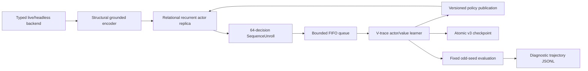

# Relational grounded-candidate V-trace baseline (v3)

This document is the normative architecture for the restarted RL line. The v1
grounded single-step replay learner and the relation-poor v2 recurrent learner
did not establish a useful Act 1 baseline and are not migration sources. Their
checkpoints and metrics may be retained as failure evidence, but v3 starts from
fresh random parameters and rejects both older model/encoding ABIs.

## Scope

The baseline learns directly from the authoritative legal action set exposed by
the typed live or headless environment. It has no MuZero dynamics, MCTS, planner,
demonstration loss, card/boss/route rule, action rewrite, Q head, reward-prediction
head or terminal-prediction head.



## Model

`RecurrentCandidateModel` preserves the reviewed world/candidate separation:

1. `encode_world` reads structural world tokens and the decision domain only.
2. Every world entity carries both a stable definition identity and, where the
   runtime supplies one, a concrete instance/relation identity.
3. `encode_candidates` attends the exact world tokens and separately pools
   exact-instance and same-definition evidence for its source and target. A
   learned projection decides how to combine those four channels; no fixed
   tactical ratio is encoded.
4. Two GRU halves consume candidate-independent state: run memory updates on
   macro decisions, while combat memory updates in combat and is cleared on
   exit. Hundreds of card plays cannot overwrite route/build memory.
5. The recurrent context conditions a masked legal-candidate policy.
6. One scalar value predicts the configured task horizon.

The default contract is:

- structural feature width: 224;
- world/candidate width: 128;
- world layers: 3;
- latent slots: 12;
- recurrent hidden width: 256;
- parameters: 4,014,146;
- output heads: masked policy and scalar value only.

The model-facing observation uses the versioned
`grounded-relational-runtime-encoding-v8` contract together with the factual
[`grounded-card-facts-encoding-v3`](./card-facts-abi.md) mechanics ABI. Card effects
come from exact runtime `DynamicVar`, keyword, tag and lifecycle facts, not from
description parsing or curated card rules. The default capacity is 2,048 world
tokens and 64 local tokens per candidate. Fact-identical copies in the permanent
deck and public orderless combat piles share one exact counted variant, while
hands, selections, candidates and distinct modified variants stay separate.
Overflow is an error with exact structural diagnostics, never silent
truncation. This encoder change invalidates every earlier checkpoint.

Candidate permutation must permute policy outputs in the same way while leaving
the world encoding, recurrent state and value unchanged. Opaque dispatch handles
are not model inputs. Only the environment legality mask can suppress an action.

### Factual relation coverage

The encoder exposes relationships which a policy would otherwise have to infer
from unstable list positions:

| Relation | Representation |
|---|---|
| same card definition vs. concrete copy | separate `entity_id` and runtime `entity_aux_id` for concrete hand/selection/action entities; exact `quantity` for fact-identical copies in orderless multisets |
| card to dynamic vars, enchantment and affliction | shared concrete relation identity |
| card to Deck/Hand/Draw/Discard/Exhaust/Play | fixed collision-free zone ID plus instance identity |
| play/potion action to source and enemy target | independent source/target definition and relation channels |
| enemy to powers and visible intents | shared enemy relation identity, child definition/role identity |
| potion to inventory slot | factual `slot_index` and potion zone |
| card selection/multi-select | source/destination zone, membership, operation, counts and confirmation facts |
| deck upgrade | original instance bound to its factual upgrade preview |
| shop choice | exact shelf slot, nested item, price, stock and affordability facts |
| rest choice | native option type/enabled state and exact heal amount when supplied by the game |
| reward choice | reward card/relic/potion identity and explicit add/skip mutation family |
| map route | coordinate identities, point/room types and explicit directed edge tokens |
| action consequence | only guaranteed immediate protocol mutation/resource facts; never predicted damage, draws, event results or future RNG |

Draw-pile composition is player-inspectable and is encoded as a canonical
unordered counted multiset; hidden draw order is never exposed. Active map/shop/rest,
reward and selection surfaces are included only where decision-relevant so the
interface does not serialize inactive UI trees on every combat action.

## Training data contract

`SequenceUnroll` is a contiguous recurrent segment. It stores:

- initial recurrent state;
- exact sparse encoded decision snapshots;
- selected candidate indexes;
- behavior log-probabilities;
- immediate scalar rewards and discounts;
- forced-vs-policy decision flags;
- behavior policy version;
- an optional next-state snapshot for value bootstrap.

The final discount is zero exactly at task terminal/deadlock. A positive final
discount requires a bootstrap snapshot. Unrolls are placed in a bounded FIFO and
consumed once. There is no replay capacity measured in transitions, recent mix,
coverage mix, priority, TD-error refresh, resampling, demonstration partition or
backfill.

The learner may publish a new policy while a long episode is running, but the
actor adopts it only after emitting a complete recurrent unroll. At episode end
the actor waits for an explicit main-thread acknowledgement, allowing metrics,
periodic checkpointing and held-out evaluation intent to commit before the next
simulator reset.

Each completed unroll also updates one compact actor-progress snapshot with the
current maximum Act/floor, cumulative reward, revivals, HP loss and exact
behavior-policy version. Learner metrics attach that snapshot without writing a
verbose per-decision training journal, so an in-flight Act 1--3 run remains
observable without sacrificing simulator throughput.

Default data-plane settings are:

- unroll length: 64 decisions;
- queue capacity: 256 unrolls;
- learner batch: 8 unrolls;
- minimum learner batch: 8 unrolls;
- one actor per typed backend session;
- maximum accepted behavior-policy lag: 1,024 learner versions.

The queue uses producer backpressure rather than eviction. Queue wait time,
occupancy, produced count and consumed count are runtime metrics.

## Learner

The learner replays each unroll recurrently under current parameters and computes
IMPALA V-trace targets from current and behavior action probabilities.
Standard-task defaults:

- discount: 0.997;
- V-trace rho clip: 1.0;
- V-trace trace-c clip: 1.0;
- policy rho clip: 1.0;
- policy loss weight: 1.0;
- value loss weight: 0.5;
- entropy weight: 0.01;
- global gradient norm clip: 1.0.

The native-revival preheat profile uses discount `1.0`, not `0.997`, so its
bounded cumulative survival scores telescope exactly over an episode.

Forced singleton actions contribute value/recurrent training but no policy loss
or policy entropy. All tensors, gradients and post-step parameters are checked
for finiteness. The learner reports importance ratios, clipping fraction, policy
lag, target/advantage means and per-stage timing.

## Actor/learner overlap

The actor owns a model replica and backend session in its own thread. It streams
completed unrolls into the queue immediately, so learner updates overlap the rest
of the same environment episode. The learner never mutates the actor module.
Policy snapshots are copied to the actor only at episode boundaries, and every
unroll records the exact behavior-policy version.

This replaces both v1 synchronous collection and the experimental one-episode
overlap wrapper. There is one maintained execution mode: bounded FIFO asynchronous
actor/learner overlap.

## Reward and initial curriculum

`sts2-task-reward-v3` has no action-quality or damage heuristic. It combines:

- task success: +1;
- task failure, semantic deadlock or an explicit curriculum horizon: -1;
- for Act/run horizons only, a bounded positive delta in monotonic run
  progress, so a failed run that travelled farther ranks above an early loss.

Combat reward does **not** pay for damage dealt, enemy-HP change, number of
cards played, or any preferred action. Those quantities may remain factual
observations/diagnostics, but they are not reward terms.

The default standard full-run objective and the native-revival preheat objective
are both `run`: entering Act 2 is ordinary forward progress rather than an
artificial episode boundary. Both profiles traverse route, reward, event, shop,
rest, combat, and build decisions until the complete run terminates. The retained
`act1` objective and the `combat` profile are explicit software diagnostics, not
gates or the main training route. Backend reward scalars are not targets.

No human-data cold start is required for the first v3 baseline. Human trajectories
may be evaluated later as a separately versioned experiment; they must not be
silently mixed into this baseline.

The optional `preheat` profile is a separate, versioned full-run curriculum. It
adds the game's native `RELIC.LIZARD_TAIL` to the normal starter relic set at a
fresh full-run reset. The simulator-only training controller budgets that same
native death-prevention path across the entire run; `-1` means unlimited and
normal profiles leave it disabled. The relic still performs the game's own
death hook, flash and 50% maximum-HP heal. Only the training copy is re-armed
after it fires.

The simulator exports exact monotonic `training_revivals_used` and
`training_player_hp_lost` counters. HP loss is recorded at `Creature.LoseHp`
from actual HP removed, so overkill is not counted and later healing cannot
erase prior loss. These counters are translated under `observation._training`:
they are reward/evaluation facts and the grounded encoder never sees them.

`sts2-run-survival-efficiency-v3` combines the final run outcome and monotonic
forward run distance with three bounded costs:

- a terminal margin that makes every run victory rank above every failure;
- a cumulative cost for exact player HP lost;
- a cumulative cost for exact native revivals used;
- a small cost per environment decision.

The profile keeps a 30,000-decision outer transport-safety ceiling and uses
undiscounted return. Exact semantic deadlock detection can terminate a genuine
reversible UI loop earlier; the outer ceiling is not an Act boundary or
curriculum gate. All survival/pace costs together are bounded below one point, so the
terminal margin guarantees every victory ranks above every failure. Forward
floor progress gives failed runs useful ordering without paying for damage or
specific choices. Within the same outcome the weighted objective prefers:

1. finish the run and travel farther;
2. lose less player HP and consume fewer revivals;
3. finish in fewer decisions.

This is not an invincibility/no-consequence dataset and it does not supervise
random actions as correct. Epsilon exploration uses revival as a safety net to
reach later map, build, reward, event, shop, rest, elite, and boss decisions;
V-trace trains policy and value from run outcome, forward distance, survival,
and pace consequences. Evaluation reports run/Act-1 success, floor, decision
count, exact HP lost, revivals used, and revival-free success rates.

WSL/ROCm preheat starts the native-revival full game directly. There is no
random-combat, Act-1, Act-2 or Act-3 behavior gate in the launch path. Act
crossings and the real terminal outcome are metrics from the same uninterrupted
episode, not prerequisites that repeatedly rerun parts of the game. The short
formal preflight verifies the pinned simulator identity, runtime-mechanics
schema and one real event-to-combat transport path; it does not score actions or
truncate the training curriculum.

Learner collation pads only to the largest active world/candidate/local shape
in each batch. The configured 512/96/64 capacities remain fail-closed input
limits, but are not paid on every small decision. The preheat profile uses
16-step recurrent unrolls in batches of four so an initial ROCm update completes
before the asynchronous collector can accumulate hours of unusable rollout.

## Deadlock diagnostics

Evaluation canonicalizes the complete observation and legal candidates after
removing only transport identities such as request UUIDs, dispatch handles,
timestamps and revision counters. Repeated semantic decision/action pairs in a
bounded window produce explicit `DeadlockEvidence` and terminate the task as a
failure.

This is a generic loop detector, not a card/UI/boss heuristic. Evaluation writes
versioned JSONL with compact observations, legal actions, selected action, policy
top-k, value, reward breakdown and deadlock evidence. These journals are
diagnostic artifacts and never enter the rollout queue.

## Evaluation schedule

Training seeds are even; held-out evaluation seeds are odd. The default v3 gates
are steps 0, 10,000, 25,000 and 50,000, with fixed seeds and deterministic policy.
Reports include:

- Act 1 clear rate;
- run/combat win rate as applicable;
- semantic deadlock rate;
- mean and maximum floor;
- mean maximum act;
- mean undiscounted reward.
- for revival preheat, mean exact player HP lost, mean revivals used,
  revival-free Act-1/run success rates, and full-run progress.

No Act 1 performance claim is valid without these held-out evaluations and their
trajectory journals.

## Checkpoint ABI

The format is `sts2-recurrent-vtrace-checkpoint-v3` and contains:

```text
metadata.json
network.pt
actor_network.pt
optimizer.pt
rollout_queue.pkl
stochastic_state.pkl
checkpoint.manifest.json
```

Publication is atomic and SHA-256 covers every payload. Exact resume validates
the contract/reward/dependency identities, model and encoding config, learner and
actor tensor specifications, optimizer layout, pending unrolls, devices, RNGs and
collector continuation state before mutating live resources. Old checkpoints
containing `replay_buffer.pkl` are rejected; there is no v1 compatibility loader.

## Commands

```powershell
Set-Location .\packages\rl-agent
python -m ruff check sts2_rl sts2_baseline launcher.py launcher_watchdog.py
python -m mypy sts2_rl sts2_baseline
python -m pytest tests -q -p no:cacheprovider
python -m sts2_rl.train --dry-run

# Optional combat transport diagnostic
python -m sts2_rl.train --profile combat --sim-exe <PINNED_RELEASE_EXE>

# Native-revival full-run knowledge preheat (Windows CPU)
python scripts/audit_card_fact_coverage.py --sim-exe <PINNED_RELEASE_EXE>
python scripts/audit_runtime_mechanics_coverage.py --sim-exe <PINNED_RELEASE_EXE>
python -m sts2_rl.train --profile preheat --sim-exe <PINNED_RELEASE_EXE>

# Native-revival knowledge preheat (WSL/ROCm; refuses CPU fallback)
wsl.exe -- bash -lc 'export STS2_ARTIFACT_ROOT=<WSL_ARTIFACT_ROOT>; cd <WSL_REPOSITORY_ROOT>/packages/rl-agent; bash scripts/train_preheat_wsl_rocm.sh'

# Main Act 1 baseline
python -m sts2_rl.train --profile default --sim-exe <PINNED_RELEASE_EXE>
```

Mutable output must remain below `STS2_ARTIFACT_ROOT`, outside the source tree.
Formal headless runs require the pinned Release simulator and identity sidecar.
They also run the native catalog and event-to-combat runtime-mechanics preflight
before backend launch. See [`runtime-mechanics-abi.md`](./runtime-mechanics-abi.md).
