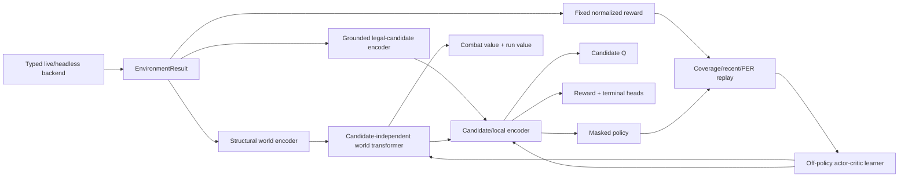

# Grounded Candidate RL Baseline

Status: **implemented, unit/integration tested, not yet long-run trained**.

This document defines the only maintained RL architecture after the July 2026
reboot. The previous MuZero/token-memory/MCTS line and its boss, card, potion,
route and action-guard heuristics were deleted because its historical runs did
not clear Act 1 reliably. Those checkpoints are not valid parents for this
baseline.

## Non-goals

The baseline does not contain:

- learned or deterministic latent dynamics;
- MCTS, direct planners, root priors or search-policy distillation;
- card-, boss-, route-, shop-, potion- or end-turn-specific rules;
- action filtering, action retargeting or policy-logit rewrites beyond the
  authoritative environment legality mask;
- objective vectors, settlement rewards or backend-provided reward fallbacks;
- ordinal candidate embeddings; or
- compatibility loading for old model/checkpoint tensors.

## Architecture



### Structural encoder

`packages/rl-agent/sts2_rl/encoding/grounded.py` first projects live and
headless observations into one versioned model DTO. The projection deliberately
uses the observable intersection: for example, headless draw/discard/exhaust
card identities become the same counts exposed by live, inactive simulator UI
sections are omitted, `deck`/`deck_cards` aliases are normalized, and episode-
local target IDs are joined to stable enemy facts before being removed from
model input.

The remaining object/list tree is encoded without a game-mechanics table.
Reviewed numeric keys have unique, fixed feature slots; categorical facts and
arbitrary game-provided dynamic variables use separate SHA-256 regions. Entity
identity uses two independently namespaced hashes and two embedding tables, so
a collision in one bucket is not an identity alias. Feature capacity is a
versioned 128-dimensional ABI (the default tensor is 160-dimensional).

The encoder has two separate paths:

1. World encoding excludes candidate containers, dispatch handles, simulator
   internals and retired engineered fields.
2. Candidate encoding reads only the current legal action objects and their
   local source/target objects. Candidate transport position and opaque action
   handle are not model features.

Every adapter must emit a `model_action_kind` from a closed vocabulary. Unknown
simulator enums, missing kinds, excess legal candidates, non-finite facts, and
world/local token overflow fail closed instead of creating a new category or
silently truncating training data. Event option text is an opaque visible
identity only; it is never parsed into predicted effects.

The dispatch table stays outside the tensors. Therefore changing action handles
or permuting equivalent candidates cannot change the candidate-independent
state representation. The complete allowlist, exclusion firewall, slot layout,
domain vocabulary and action vocabulary are SHA-256 fingerprinted. Decisions,
replay payloads and checkpoints reject a different encoding fingerprint.

### Model

`packages/rl-agent/sts2_rl/models/grounded_candidate.py` is a small transformer
with **3,642,824 parameters** at the default configuration.

- `encode_world(world, domain_ids)` cannot access candidates by type/API.
- Candidates cross-attend the already-computed world latents.
- The candidate-set transformer has no position embedding and is permutation
  equivariant.
- Illegal candidates have zero probability and zero Q/reward/outcome outputs.
- State values are split into combat-horizon and run-horizon heads.
- Candidate Q, immediate reward and terminal-class heads make outcome errors
  visible without inventing a latent world model.
- Masked policy probabilities are calculated and returned in float32 even when
  model logits use fp16/bfloat16, avoiding low-probability underflow.

### Reward

`packages/rl-agent/sts2_baseline/reward.py` owns one immutable reward version.

- combat win/loss and run win/loss are separate task terminals;
- HP and enemy progress are ratios rather than absolute values;
- run progress is normalized to `[0, 1]`;
- dense potential shaping is capped at `0.25` magnitude;
- task-terminal potential is forced to zero; and
- backend reward, objective vectors and settlement bonuses have no API entry.

The reward discount and return discount must match. Configuration rejects a
different value rather than silently changing reward semantics. The fingerprint
includes both calculator coefficients and the fact-to-potential/terminal projection
(floor cap, result map and truncation rules); replay decisions and checkpoints reject
a different fingerprint.

### Replay and learner

Replay samples are stratified by structural domain/encounter metadata before
sampling inside each stratum. The default mixture is:

- 50% coverage-uniform;
- 25% recent-uniform; and
- 25% proportional priority replay.

Sampling returns stable replay IDs, exact mixture probabilities and importance
weights. The learner refreshes priorities from current TD error after every
update.

Online trajectories receive auditable discounted Monte Carlo targets. Forced
single-action protocol decisions are stored but make no policy-gradient
contribution. The learner jointly trains masked policy, selected-candidate Q,
the active horizon value, immediate reward and terminal classification.

## Training curriculum

There are two configurations, not an A/B comparison or an attempt to preserve
the failed route:

1. `combat` is an optional short-horizon bootstrap using the same model and
   encoder with the combat value/reward horizon.
2. `default` is the required full-run mainline and optimizes the run horizon.

The cleanest route is to start `default` from random initialization. If early
full-run collection is too sparse, `combat` may train the same tensor/model ABI
first, followed by a **new lineage** that imports only the complete RL 0.3 model
state with `--initialize-from`. The source must also pass the current atomic hashes,
contract, reward, dependency-lock and encoding gates. Optimizer, replay, counters,
reward horizon and RNG state are never carried across that curriculum boundary. This is a
same-baseline curriculum transition, not loading a MuZero/legacy checkpoint.

No metric gate injects rules into the policy. Curriculum changes only the task/reward
horizon, environment data distribution, exploration schedule and execution/evaluation
budget. The evaluation surface reports:

- Act 1 clear rate (Act 2 reached);
- run win rate;
- combat win rate for combat evaluation;
- maximum act and floor; and
- mean undiscounted reward total.

Training resets use an even signed-32-bit seed namespace. Evaluation uses a fixed odd
prefix derived from the configured base seed, so held-out seeds never enter training.
Every evaluation log records the seed and complete per-episode metrics as well as the
aggregate.

The first acceptance target is a statistically meaningful non-zero Act 1 clear
rate on held-out seeds. **No such result is claimed yet.** Dry-run, unit and fake
backend integration tests validate software behavior only.

## Commands

From `packages/rl-agent`:

```powershell
python -m sts2_rl.train --dry-run
python -m sts2_rl.train --profile combat
python -m sts2_rl.train --profile default
```

Optional combat-to-run model initialization:

```powershell
python -m sts2_rl.train `
  --profile default `
  --initialize-from "$env:STS2_ARTIFACT_ROOT/checkpoints/grounded-combat-bootstrap/run-<uuid>/final-step-<steps>"
```

Use strict dotted overrides for experiments:

```powershell
python -m sts2_rl.train --set runtime.total_environment_steps=2000000
```

ROCm/WSL live-bridge launch:

```bash
bash scripts/train_grounded_wsl_rocm.sh --profile default
```

All mutable logs, replay and checkpoints live below `STS2_ARTIFACT_ROOT` (or
`~/.sts2-artifacts`). Every invocation creates a fresh unique `run-<uuid>` child,
so a resume never overwrites its parent. Each published checkpoint child is immutable.
Checkpoints atomically publish model,
optimizer, replay, training counters, update credit, Python/NumPy/Torch RNG and
collector RNG/seed state. Exact resume rejects contract, reward, dependency
lock, resolved-device, model tensor, encoding fingerprint, optimizer, replay or
immutable-lineage drift. Static `game-data` is optional audit provenance when a valid
catalog manifest is present; it is neither a runtime dependency nor an exact-resume
identity because this baseline does not read it.

## Validation

```powershell
python -m ruff check sts2_rl sts2_baseline
python -m mypy sts2_rl sts2_baseline
python -m pytest tests -q
python -m sts2_rl.train --dry-run
```

Long-run training and held-out Act 1 evaluation remain operational work, not a
completed result.
