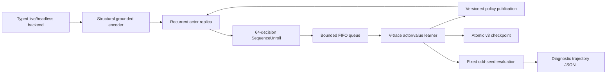

# Recurrent grounded-candidate V-trace baseline (v2)

This document is the normative architecture for the restarted RL line. The v1
grounded single-step replay learner did not clear Act 1 and is not a migration
source. Its checkpoints and metrics may be retained as failure evidence, but v2
starts from fresh random parameters and rejects the v1 checkpoint ABI.

## Scope

The baseline learns directly from the authoritative legal action set exposed by
the typed live or headless environment. It has no MuZero dynamics, MCTS, planner,
demonstration loss, card/boss/route rule, action rewrite, Q head, reward-prediction
head or terminal-prediction head.



## Model

`RecurrentCandidateModel` preserves the reviewed world/candidate separation:

1. `encode_world` reads structural world tokens and the decision domain only.
2. `encode_candidates` grounds each currently legal candidate against the world
   latents without candidate-position embeddings.
3. A GRU consumes the candidate-independent state embedding and the previous
   recurrent state.
4. The recurrent context conditions a masked legal-candidate policy.
5. One scalar value predicts the configured task horizon.

The default contract is:

- structural feature width: 160;
- world/candidate width: 128;
- world layers: 3;
- latent slots: 12;
- recurrent hidden width: 256;
- parameters: 3,971,778;
- output heads: masked policy and scalar value only.

Candidate permutation must permute policy outputs in the same way while leaving
the world encoding, recurrent state and value unchanged. Opaque dispatch handles
are not model inputs. Only the environment legality mask can suppress an action.

## Training data contract

`SequenceUnroll` is a contiguous recurrent segment. It stores:

- initial recurrent state;
- exact sparse encoded decision snapshots;
- selected candidate indexes;
- behavior log-probabilities;
- immediate scalar rewards and discounts;
- forced-vs-policy decision flags;
- behavior policy version;
- an optional next-state snapshot for value bootstrap.

The final discount is zero exactly at task terminal/deadlock. A positive final
discount requires a bootstrap snapshot. Unrolls are placed in a bounded FIFO and
consumed once. There is no replay capacity measured in transitions, recent mix,
coverage mix, priority, TD-error refresh, resampling, demonstration partition or
backfill.

Default data-plane settings are:

- unroll length: 64 decisions;
- queue capacity: 256 unrolls;
- learner batch: 8 unrolls;
- minimum learner batch: 8 unrolls;
- one actor per typed backend session;
- maximum accepted behavior-policy lag: 1,024 learner versions.

The queue uses producer backpressure rather than eviction. Queue wait time,
occupancy, produced count and consumed count are runtime metrics.

## Learner

The learner replays each unroll recurrently under current parameters and computes
IMPALA V-trace targets from current and behavior action probabilities. Defaults:

- discount: 0.997;
- V-trace rho clip: 1.0;
- V-trace trace-c clip: 1.0;
- policy rho clip: 1.0;
- policy loss weight: 1.0;
- value loss weight: 0.5;
- entropy weight: 0.01;
- global gradient norm clip: 1.0.

Forced singleton actions contribute value/recurrent training but no policy loss
or policy entropy. All tensors, gradients and post-step parameters are checked
for finiteness. The learner reports importance ratios, clipping fraction, policy
lag, target/advantage means and per-stage timing.

## Actor/learner overlap

The actor owns a model replica and backend session in its own thread. It streams
completed unrolls into the queue immediately, so learner updates overlap the rest
of the same environment episode. The learner never mutates the actor module.
Policy snapshots are copied to the actor only at episode boundaries, and every
unroll records the exact behavior-policy version.

This replaces both v1 synchronous collection and the experimental one-episode
overlap wrapper. There is one maintained execution mode: bounded FIFO asynchronous
actor/learner overlap.

## Reward and initial curriculum

`sts2-task-reward-v2` has no mechanic-specific rules. It combines:

- task success: +1;
- task failure or semantic deadlock: -1;
- a capped potential delta using generic player HP, enemy HP progress and run
  progress facts.

The default full-run objective is `act1`: entering Act 2 is success and dying or
deadlocking before Act 2 is failure. The `combat` profile is an optional software
and representation bootstrap. A `run` objective remains available only for later
full-run experiments. Backend reward scalars are not targets.

No human-data cold start is required for the first v2 baseline. Human trajectories
may be evaluated later as a separately versioned experiment; they must not be
silently mixed into this baseline.

The optional `preheat` profile is a separate, versioned combat curriculum. It
adds the game's native `RELIC.LIZARD_TAIL` to the normal starter relic set at
combat reset and reads the simulator's authoritative `is_used_up` state. A
revival event exists only when that field changes from `false` to `true`; HP
increases, healing and transport omissions do not imply revival.

`sts2-native-revival-efficiency-v1` layers three bounded terms over the normal
combat task reward:

- a terminal margin that makes every victory rank above every failure;
- a cost for each exact native revival consumption;
- a small cost per environment decision.

The profile caps episodes at 512 decisions. At that horizon, the complete pace
budget is smaller than one revival cost, and the terminal margin dominates all
revival/pace costs. The intended preference is therefore lexicographic:

1. win the combat;
2. among wins, consume fewer revivals;
3. at equal revival count, finish in fewer decisions.

This is not an invincibility/no-consequence dataset and it does not supervise
random actions as correct. Epsilon exploration supplies broad state/action
coverage, while V-trace trains policy and value from outcome, revival and pace
consequences. Evaluation reports mean decision count, mean revivals used and
revival-free combat win rate. A revival-free win leaves the injected relic
unused and is the primary gate before switching to the normal combat/full-run
curriculum.

## Deadlock diagnostics

Evaluation canonicalizes the complete observation and legal candidates after
removing only transport identities such as request UUIDs, dispatch handles,
timestamps and revision counters. Repeated semantic decision/action pairs in a
bounded window produce explicit `DeadlockEvidence` and terminate the task as a
failure.

This is a generic loop detector, not a card/UI/boss heuristic. Evaluation writes
versioned JSONL with compact observations, legal actions, selected action, policy
top-k, value, reward breakdown and deadlock evidence. These journals are
diagnostic artifacts and never enter the rollout queue.

## Evaluation gates

Training seeds are even; held-out evaluation seeds are odd. The default v2 gates
are steps 0, 10,000, 25,000 and 50,000, with fixed seeds and deterministic policy.
Reports include:

- Act 1 clear rate;
- run/combat win rate as applicable;
- semantic deadlock rate;
- mean and maximum floor;
- mean maximum act;
- mean undiscounted reward.

No Act 1 performance claim is valid without these held-out evaluations and their
trajectory journals.

## Checkpoint ABI

The format is `sts2-recurrent-vtrace-checkpoint-v3` and contains:

```text
metadata.json
network.pt
actor_network.pt
optimizer.pt
rollout_queue.pkl
stochastic_state.pkl
checkpoint.manifest.json
```

Publication is atomic and SHA-256 covers every payload. Exact resume validates
the contract/reward/dependency identities, model and encoding config, learner and
actor tensor specifications, optimizer layout, pending unrolls, devices, RNGs and
collector continuation state before mutating live resources. Old checkpoints
containing `replay_buffer.pkl` are rejected; there is no v1 compatibility loader.

## Commands

```powershell
Set-Location .\packages\rl-agent
python -m ruff check sts2_rl sts2_baseline launcher.py launcher_watchdog.py
python -m mypy sts2_rl sts2_baseline
python -m pytest tests -q -p no:cacheprovider
python -m sts2_rl.train --dry-run

# Optional combat bootstrap
python -m sts2_rl.train --profile combat --sim-exe <PINNED_RELEASE_EXE>

# Native-revival knowledge preheat (Windows CPU)
python -m sts2_rl.train --profile preheat --sim-exe <PINNED_RELEASE_EXE>

# Native-revival knowledge preheat (WSL/ROCm; refuses CPU fallback)
wsl.exe -- bash -lc 'export STS2_ARTIFACT_ROOT=/mnt/e/game/project/sts2_mcp_artifacts/runtime; cd /mnt/e/game/project/sts2_mcp/packages/rl-agent; bash scripts/train_preheat_wsl_rocm.sh'

# Main Act 1 baseline
python -m sts2_rl.train --profile default --sim-exe <PINNED_RELEASE_EXE>
```

Mutable output must remain below `STS2_ARTIFACT_ROOT`, outside the source tree.
Formal headless runs require the pinned Release simulator and identity sidecar.
